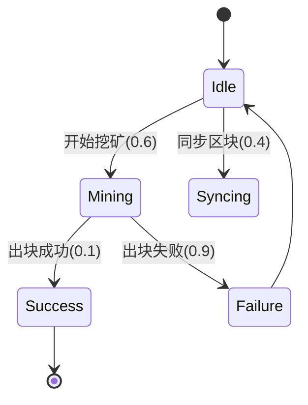

## 引言

区块链系统因其分布式、不可篡改等特性，在金融、供应链等领域广泛应用。然而，其复杂的行为逻辑和概率性共识机制（如PoW/PoS）使得传统测试方法难以全面验证系统可靠性。PRISM作为**概率符号模型检测器**，能够通过数学建模验证区块链的以下核心属性：

1. **共识协议正确性**（如最终一致性概率）
2. **智能合约安全边界**（如漏洞触发概率）
3. **资源竞争分析**（如分叉概率与算力关系）

## 基础概念

### 马尔可夫决策过程（MDP）
区块链节点行为可建模为MDP，其中：
- **状态**：区块高度、节点算力、网络拓扑
- **动作**：挖矿/转发/验证区块
- **概率转移**：如挖矿成功概率与算力成正比



### PRISM 属性规范
使用PCTL（概率计算树逻辑）描述需求：
```prism
// 在10个区块内达成共识的概率≥95%
P≥0.95 [ F<=10 "consensus_achieved" ]

// 恶意节点控制51%算力的长期概率
S=? [ "malicious_dominant" ]
```

## 案例研究：PoW区块链分析

### 模型构建
```prism
// 定义节点类型
module Node
    state : [0..3] init 0; // 0=空闲, 1=挖矿, 2=同步, 3=验证
    hashrate : [0..100]; // 算力百分比
    
    [startMine] state=0 -> 0.6:(state'=1) + 0.4:(state'=2);
    [mine] state=1 -> hashrate/100:(state'=3) 
                    + (1-hashrate/100):(state'=0);
endmodule

// 定义攻击者模块
module Attacker
    controlled_ratio : [0..1]; // 控制算力比例
    // ...攻击行为定义...
endmodule
```

### 关键验证场景
1. **分叉概率分析**：
   ```prism
   // 计算6个确认后的分叉概率
   P=? [ F<=6 "fork_occurred" ]
   ```
   输出示例：
   ```
   Result: 0.0012 (0.12%)
   ```

2. **双花攻击检测**：
   ```prism
   // 当攻击者控制30%算力时双花成功率
   filter(print, P>=0, Attacker.controlled_ratio=0.3,
        F "double_spend_success");
   ```

## 智能合约验证案例

### 竞态条件检测
建模ERC20转账的竞态漏洞：
```prism
module Transfer
    balance : [0..100];
    [transfer] balance>=10 -> 0.8:(balance'=balance-10) 
                          + 0.2:(balance'=balance); // 重入漏洞
endmodule

// 验证余额异常概率
P=? [ F balance>initial_balance ]
```

## 最佳实践

:::tip 建模建议
1. **分层抽象**：先验证核心共识逻辑，再添加网络延迟等细节
2. **参数化建模**：使用`const double p = 0.5;`便于参数调整
3. **模块化设计**：分离节点行为与攻击模式
:::

## 总结

通过PRISM验证区块链系统可发现：
- 共识协议在特定网络条件下的失效概率
- 智能合约中隐藏的概率性漏洞
- 资源分配对系统安全的影响边界

## 扩展练习
1. 修改PoS模型的质押比例参数，观察最终性概率变化
2. 为ERC721合约添加重入保护机制并验证漏洞消除
3. 使用`multi-objective`分析安全性与吞吐量的权衡

## 学习资源
- PRISM官方案例库：`/examples/blockchain`
- 论文《Formal Verification of Ethereum 2.0 Consensus》
- 在线实验平台：WebPRISM区块链专题
``` 

注意：所有代码块和mermaid图表在实际MDX文件中需用