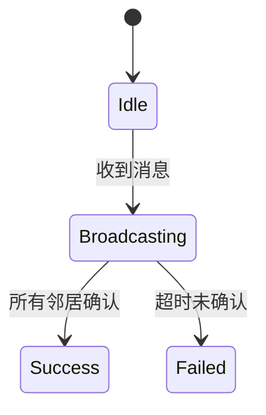

# PRISM 分布式算法分析

## 引言

分布式算法是计算机科学中处理多节点协同工作的核心领域，常用于共识协议、分布式存储等场景。PRISM作为概率符号模型检测工具，能够对分布式算法的**正确性**和**性能**进行形式化验证。本章将通过案例演示如何用PRISM建模分布式系统，并分析其概率性质（如消息丢失时的系统可靠性）。

---

## 基础概念

### 1. 分布式算法的PRISM建模特点
- **并发进程**：用`module`定义多个并行执行的节点
- **通信机制**：通过共享变量或同步标签（`[]`）模拟消息传递
- **不确定性**：使用`probabilistic`命令建模随机行为（如消息延迟）

### 2. 关键分析目标


---

## 案例研究：拜占庭将军问题

### 1. 问题描述
N个将军中最多有f个叛徒时，如何通过消息传递达成一致决策？PRISM可验证不同算法在叛徒概率下的可靠性。

### 2. PRISM模型片段
```prism
// 定义将军节点
module General1
    state1: [0..2]; // 0:未决定, 1:进攻, 2:撤退
    [send] (state1=0) -> 0.8: (state1'=1) + 0.2: (state1'=2); // 80%概率选择进攻
endmodule

// 叛徒节点行为
module Traitor
    [send] true -> 0.5: (message'=1) + 0.5: (message'=0); // 随机发送矛盾信息
endmodule
```

### 3. 属性验证示例
```prism
// 验证超过2/3将军达成一致的概率
P>=0.95 [ F (agree_count >= 2*N/3) ]
```

---

## 进阶案例：P2P网络中的广播协议

### 1. 模型设计


### 2. 关键PRISM特性应用
- **概率传输失败**：
  ```prism
  [send] (attempt < MAX_ATTEMPTS) -> 
    0.9: (success'=true) + 
    0.1: (attempt'=attempt+1);
  ```
- **MTTF计算**：
  ```prism
  R{"time"}min=? [ F broadcast_complete ]
  ```

---

## 实际应用场景

:::tip 区块链共识分析
通过修改以下参数验证PoW算法的抗攻击能力：
```prism
const double p_honest = 0.6; // 诚实节点算力占比
const int k = 6; // 确认区块数
```
:::

---

## 总结与练习

### 关键要点
1. PRISM可通过DTMC/MDP建模消息传递的不确定性
2. 使用`P`运算符量化协议成功概率
3. 奖励机制(`R`)可分析吞吐量等性能指标

### 推荐练习
1. 扩展拜占庭模型，增加消息延迟概率
2. 为P2P广播添加节点动态加入/离开逻辑
3. 验证Paxos算法在异步网络中的活性

### 延伸阅读
- PRISM官方文档：分布式案例库
- 《分布式系统：概念与设计》第3章
- TLA+与PRISM的对比分析论文