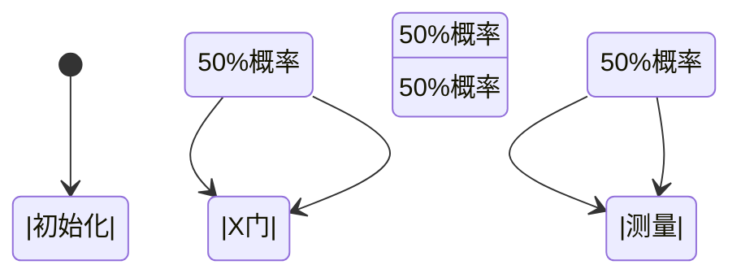

## 引言

量子计算和量子通信系统的设计需要严格的验证方法，以确保其正确性和可靠性。PRISM作为概率符号模型检测工具，能够对量子系统的概率行为进行形式化建模和验证。本章将介绍如何利用PRISM分析量子比特操作、量子纠错协议等场景，并通过案例展示实际应用。

:::note 关键概念
- **量子系统特性**：叠加态、纠缠态、概率性演化
- **PRISM适配性**：通过离散时间马尔可夫链(DTMC)或马尔可夫决策过程(MDP)建模量子行为
:::

---

## 基础理论

### 1. 量子系统的PRISM建模要素
量子系统在PRISM中通常表示为：
- **状态变量**：量子比特状态（如 `qbit∈{0,1,superposition}`）
- **转移矩阵**：用概率命令描述量子门操作
- **奖励结构**：量化保真度等性能指标

### 2. 典型建模模式
```prism
// 单量子比特的X门操作模型
dtmc

module Qubit
    q : [0..2] init 0;  // 0=|0⟩, 1=|1⟩, 2=叠加态

    [x_gate] q=0 → 0.5:(q'=1) + 0.5:(q'=2);
    [x_gate] q=1 → 0.5:(q'=0) + 0.5:(q'=2);
    [measure] q=2 → 0.5:(q'=0) + 0.5:(q'=1);
endmodule
```

---

## 案例研究：量子纠错协议验证

### 1. 三比特位翻转码模型
```prism
// 编码阶段
module Encoder
    logical_q : [0..1];
    physical_q1 : [0..1];
    physical_q2 : [0..1];
    physical_q3 : [0..1];

    [encode] logical_q=0 → 
        (physical_q1'=0) & (physical_q2'=0) & (physical_q3'=0);
    [encode] logical_q=1 → 
        (physical_q1'=1) & (physical_q2'=1) & (physical_q3'=1);
endmodule

// 错误通道（概率性位翻转）
module Error
    [error] true → 
        0.9:(physical_q1'=physical_q1) & 
        0.1:(physical_q1'=1-physical_q1);
    // 类似定义q2,q3...
endmodule
```

### 2. 验证属性示例
```prism
// 解码后逻辑比特正确的概率
P=? [ F (logical_q_decoded=original_value) ]

// 最大错误率阈值验证
P>=0.99 [ F error_corrected ]
```

---

## 可视化分析



---

## 实际应用场景

### 量子密钥分发(QKD)协议验证
1. **BB84协议建模**：
   - 状态：发送方的基选择（`basis_A`）和接收方的基选择（`basis_B`）
   - 属性验证：`P=? [ F (key_mismatch_ratio < 0.11)]`

2. **噪声信道影响分析**：
   ```prism
   reward "eavesdrop_detect"
       [basis_match] true : 1;
   endreward
   ```

---

## 总结与练习

### 关键要点
- PRISM可通过概率建模捕获量子系统的不确定性
- 量子纠错协议的可恢复性可表述为PCTL属性
- 奖励结构适用于量化量子通信效率

### 进阶练习
1. 扩展三比特码模型，加入相位翻转错误
2. 验证Grover搜索算法的成功概率与迭代次数的关系
3. 为量子隐形传态协议添加时序约束验证

:::tip 学习资源
- 《Quantum Computation and Quantum Information》Nielsen & Chuang
- PRISM官方案例库中的 `quantum/` 目录
:::