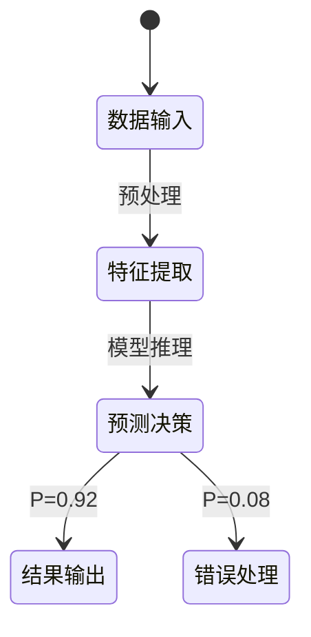

# PRISM 机器学习系统分析

## 引言
PRISM作为概率符号模型检测工具，能够对机器学习系统进行**形式化验证**。本章将展示如何用PRISM建模机器学习组件（如分类器或强化学习代理），并通过概率属性验证其鲁棒性、公平性等关键指标。

:::note 为什么需要PRISM分析ML系统？
- 量化**不确定性**：ML系统存在数据噪声和训练误差
- 验证**概率性保证**：如"模型在95%情况下满足准确率阈值"
- 检测**对抗脆弱性**：模拟对抗样本下的失效概率
:::

## 核心概念

### 1. 马尔可夫决策过程(MDP)建模
将ML决策过程建模为MDP，状态表示系统状态（如输入特征），动作对应模型预测：



### 2. 概率计算树逻辑(PCTL)
用PCTL表达ML系统属性：
- `P>=0.9 [ F accuracy > 0.85 ]`：准确率超过85%的概率≥90%
- `R{"energy"}<=1.5 [ C<=100 ]`：100次推理的能耗不超过1.5单位

## 实战案例：图像分类器验证

### 模型定义
```prism
// 定义分类器状态空间
mdp

module Classifier
    input : [0..3] init 0;  // 输入类型(0:正常,1-3:对抗样本)
    correct : bool;

    // 转移规则
    [predict] input=0 -> 0.95:(correct'=true) + 0.05:(correct'=false);
    [predict] input=1 -> 0.7:(correct'=true) + 0.3:(correct'=false);
    [predict] input=2 -> 0.6:(correct'=true) + 0.4:(correct'=false);
    [predict] input=3 -> 0.4:(correct'=true) + 0.6:(correct'=false);
endmodule
```

### 属性验证
验证不同输入下的正确率：
```prism
// 正常输入的正确概率
P=? [ F input=0 & correct ]

// 最差对抗样本下的正确率下限
P>=0.3 [ F input=3 & correct ]
```

输出示例：
```
Result: 0.950119 (input=0)
Property satisfied: P>=0.3 (actual: 0.400000)
```

## 高级应用：强化学习策略分析

### 安全约束验证
```prism
// 自动驾驶策略的碰撞概率
const double p_collision = 0.02;

module RL_Agent
    speed : [0..10] init 5;
    [accelerate] speed<10 -> (speed'=speed+1);
    [brake] speed>0 -> (speed'=speed-1);
    [cruise] true -> p_collision:(crashed'=true) + (1-p_collision):true;
endmodule

// 最大安全速度验证
Pmax=? [ F crashed ]
R{"energy"}min=? [ F time=100 ]
```

:::caution 注意
实际应用中需通过**统计模型检查**处理复杂状态空间：
`prism -sim -samples 10000 model.pm`
:::

## 总结与练习

### 关键收获
- PRISM可将ML组件转化为**可验证的概率模型**
- 通过PCTL/Rewards量化**可靠性指标**
- 支持**对抗性分析**和**资源消耗验证**

### 拓展练习
1. 为二分类器添加**数据漂移**参数，验证准确率衰减
2. 修改RL案例，添加多个危险状态等级
3. 尝试用`multi-objective`属性平衡准确率与能耗

### 学习资源
- PRISM官方文档：概率奖励模型章节
- 《Formal Methods for Machine Learning》第6章
- 国际验证会议案例库：HSCC 2022特别专题
