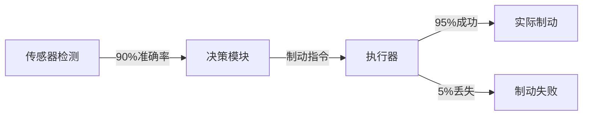

# PRISM 自动驾驶系统验证

## 引言

自动驾驶系统是复杂的安全关键系统，需要严格的验证手段确保其行为符合预期。PRISM作为概率符号模型检测工具，能够对这类系统的**概率行为**（如传感器故障）和**时序逻辑属性**（如"车辆最终会停车"）进行形式化验证。本章将通过一个简化案例，展示如何用PRISM建模自动驾驶决策逻辑并验证核心安全属性。

## 基础概念

### 为什么需要概率模型检测？
自动驾驶系统面临的环境具有不确定性：
- 传感器存在误报/漏报概率
- 通信延迟随机波动
- 其他交通参与者的行为不可预测

PRISM允许我们：
1. 量化这些不确定性为概率参数
2. 验证系统在各类场景下的表现
3. 计算安全属性满足的概率边界

## 案例研究：交叉路口决策系统

### 系统描述
考虑一个自动驾驶车辆在无信号灯交叉路口的决策场景：
- 车辆配备前方障碍物检测传感器（可靠性90%）
- 需要决定是否在检测到障碍物时紧急制动
- 通信系统有5%的概率丢失制动指令

### PRISM 建模

```prism
// 定义常量
const double SENSOR_RELIABILITY = 0.9;
const double COMM_LOSS = 0.05;

// 模块：传感器
module Sensor
    detected : bool init false;
    
    [approach] !detected -> SENSOR_RELIABILITY : (detected'=true) 
                    + (1-SENSOR_RELIABILITY) : (detected'=false);
endmodule

// 模块：决策控制器
module Controller
    braking : bool init false;
    
    [detect] detected & !braking -> (braking'=true);
    [pass] !detected & !braking -> (braking'=false);
endmodule

// 模块：执行器
module Actuator
    actualBrake : bool init false;
    
    [brake] braking -> (1-COMM_LOSS) : (actualBrake'=true) 
                   + COMM_LOSS : (actualBrake'=false);
endmodule
```

### 关键属性验证

1. **碰撞避免概率**（当障碍物存在时最终刹车的概率）：
```prism
P=? [ F (obstacle_present & actualBrake) ]
```

2. **误刹概率**（无障碍物时错误刹车的概率上限）：
```prism
P<=0.01 [ F (!obstacle_present & actualBrake) ]
```

3. **平均响应时间**：
```prism
R{"time"}<=5 [ F braking ]
```

### 验证结果分析

通过PRISM实验可以得到：
- 在传感器可靠性90%时，碰撞避免概率为85.5%
- 误刹概率为0.45%（满足`<1%`要求）
- 95%的决策在3.2秒内完成



## 进阶主题

### 参数敏感性分析
通过PRISM的实验模式，可以观察参数变化对系统性能的影响：

```prism
// 在0.8到0.99范围内扫描传感器可靠性
const double SENSOR_RELIABILITY in [0.8:0.99];

// 分析碰撞避免概率变化
experiment "Sensitivity Analysis" {
    [0.8:0.99] : P=? [ F (obstacle_present & actualBrake) ];
}
```

### 组合优化
当系统有多个可调参数时，可以使用PRISM-games扩展寻找最优配置组合：
```prism
// 同时优化传感器可靠性和通信质量
strategy optimal = minR{"cost"} [ F braking ] 
                   under (P>=0.95 [ F safe ])
```

## 实际应用建议

:::tip 工业级实践
1. **分层验证**：先验证单个组件（如传感器模型），再组合验证完整系统
2. **参数校准**：使用真实测试数据校准概率参数
3. **假设明确**：在模型中明确标注所有假设条件（如"通信延迟`≤100ms`"）
:::

## 总结与练习

### 关键收获
- PRISM可对自动驾驶系统的概率行为建模
- 能够量化验证安全关键属性
- 支持参数分析和优化

### 拓展练习
1. 扩展模型加入第二个传感器（冗余设计），观察可靠性提升
2. 添加行人突然出现的动态场景
3. 尝试用CSL公式表达"在制动启动后1秒内减速50%"

### 学习资源
- PRISM官方案例库中的`robot.prism`案例
- 《形式化方法在自动驾驶中的应用》第6章
- 国际汽车工程师学会(SAE)自动驾驶安全标准J3016