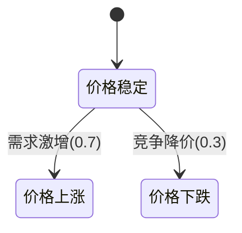

# PRISM 市场动态建模

## 介绍

市场动态建模是通过数学方法模拟市场中参与者行为、价格波动和供需关系的过程。PRISM作为**概率符号模型检测器**，能够对包含不确定性和随机性的市场系统进行形式化验证。本章将展示如何用PRISM构建市场模型，分析竞争环境下的策略选择概率、价格均衡等关键问题。

:::note 适用场景
- 竞品定价策略分析
- 供需关系随机模拟
- 市场占有率预测
- 政策干预效果评估
:::

## 基础概念

### 马尔可夫决策过程(MDP)
市场动态通常建模为**MDP**，包含：
- **状态**：如库存水平、价格区间
- **动作**：如调价、促销
- **转移概率**：动作导致的状态转换可能性



## 案例研究：双寡头价格战

### 问题描述
两家公司(A/B)在以下规则下竞争：
1. 初始价格相同(10元)
2. 每周可选择：
   - 维持价格（成本+2元）
   - 降价1元（市场份额+15%）
3. 市场总需求随机波动

### PRISM 模型构建

```prism
// 定义常量
const int MAX_PRICE = 15;
const int MIN_PRICE = 5;

// 全局变量
global priceA : [MIN_PRICE..MAX_PRICE] init 10;
global priceB : [MIN_PRICE..MAX_PRICE] init 10;

// 公司A的决策模块
module CompanyA
    [maintainA] priceA=priceA -> (priceA'=priceA);
    [reduceA] priceA>MIN_PRICE -> 0.8:(priceA'=priceA-1) + 0.2:(priceA'=priceA);
endmodule

// 公司B的决策模块（同理）
module CompanyB
    // ...类似CompanyA的结构...
endmodule

// 市场需求模块
module Market
    [reduceA] demandChange -> 0.6:(shareA'=min(1,shareA+0.15));
    [reduceB] demandChange -> 0.6:(shareB'=min(1,shareB+0.15));
endmodule
```

### 属性验证示例
验证"公司A在10周内保持市场主导地位的概率"：

```prism
P=? [ F<=10 (shareA > shareB) ]
```

典型输出结果可能是：
```
Result: 0.782 (78.2% probability)
```

## 进阶应用：政策影响分析

添加政府价格调控机制：

```prism
// 新增监管模块
module Regulator
    [reduceA] priceA < 7 -> 0.3:(fineA'=true);
    [reduceB] priceB < 7 -> 0.3:(fineB'=true);
endmodule
```

验证"罚款政策下价格低于7元的概率变化"：

```prism
P=? [ F<=20 (priceA < 7 | priceB < 7) ]
```

## 实际应用场景

1. **电商定价策略**：模拟"双十一"期间商家的动态调价
2. **金融市场**：分析利率调整对股票市场的影响
3. **能源市场**：预测碳税政策对电力价格的影响路径

:::caution 常见误区
- 忽略市场需求的时间相关性
- 未考虑竞争对手的理性反应
- 转移概率设置缺乏实际数据支持
:::

## 总结与练习

### 关键要点
- MDP模型能有效捕捉市场不确定性
- PRISM可量化分析策略的成功概率
- 政策变量应作为独立模块引入

### 拓展练习
1. 修改模型引入第三个竞争者
2. 添加季节性需求波动因素
3. 验证"价格战导致双输"的概率

### 学习资源
- PRISM官方案例库中的"Economic games"部分
- 《博弈论与市场行为》第4章
- 世界银行公开市场数据集
``` 

注：实际使用时需要：
1. 移除最外层的