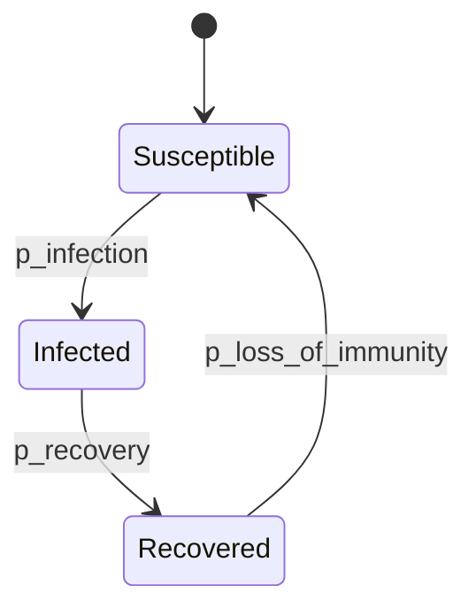
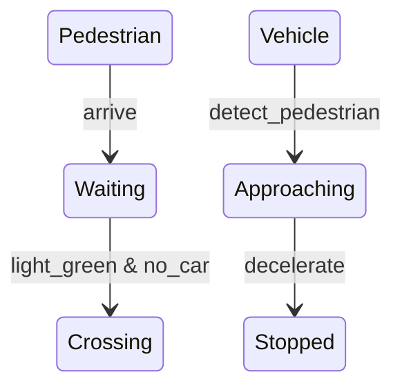

# PRISM 人群行为模型

## 介绍

人群行为模型是复杂系统分析中的重要工具，用于研究个体在群体中的交互行为及其概率性影响。PRISM作为概率符号模型检测器，能够对这类系统进行形式化建模和定量分析。本章将介绍如何用PRISM构建人群行为模型，并通过案例展示其实际应用。

:::note 关键概念
- **马尔可夫决策过程 (MDP)**：建模个体决策的不确定性
- **概率时间自动机 (PTA)**：描述时间相关的群体行为
- **群体动力学**：个体行为如何影响整体模式
:::

## 基础模型构建

### 1. 个体行为建模
每个个体的行为可以表示为一个有限状态自动机。例如，在流行病传播模型中，个体可能处于以下状态：



对应的PRISM代码片段：
```prism
module Individual
    state : [0..2] init 0; // 0=Susceptible, 1=Infected, 2=Recovered
    
    [] state=0 -> p_infection : (state'=1); // 感染转移
    [] state=1 -> p_recovery : (state'=2);  // 康复转移
    [] state=2 -> p_immunity_loss : (state'=0); // 免疫失效
endmodule
```

### 2. 群体交互建模
使用PRISM的`population`构造描述N个相同个体的交互：

```prism
const int N = 100; // 群体规模
module Person[1..N] = Individual endmodule

// 定义群体级别的感染概率
formula p_infection = 1 - (1 - base_rate)^(count_infected/N);
```

## 高级案例：恐慌疏散模拟

### 模型设计
模拟建筑物内人群在紧急情况下的疏散行为，考虑以下因素：
- 出口选择概率
- 人群密度影响移动速度
- 信息传播的级联效应

```prism
module Evacuee
    x : [0..grid_size]; y : [0..grid_size];
    moving : bool;
    knows_exit : bool init false;
    
    // 信息传播规则
    [] !knows_exit & nearby(x,y,1) knows_exit -> 0.7 : (knows_exit'=true);
    
    // 移动规则
    [] moving & knows_exit -> 0.8 : (x'=x-1);
    [] moving & !knows_exit -> 0.5 : (x'=x-1);
endmodule
```

### 属性验证示例
验证"所有人员在T时间内疏散"的概率：
```prism
P>=? [ F<=T all_evacuated ]
```

分析不同出口布局对疏散时间的影响：
```prism
const double layout_A;
const double layout_B;
// 比较两种布局的期望疏散时间
R{"time"}<=? [ F all_evacuated ] under layout_A
R{"time"}<=? [ F all_evacuated ] under layout_B
```

## 实际应用场景

### 1. 流行病传播预测
通过调整以下参数研究干预措施效果：
```prism
// 社交距离影响
formula p_infection = if social_distancing then base_rate*0.3 else base_rate;

// 疫苗接种率
const double vaccination_rate;
[] state=0 -> vaccination_rate : (state'=2); // 直接免疫
```

### 2. 交通流量优化
模拟交叉路口行人-车辆交互：


## 总结与练习

### 关键要点
- PRISM可通过模块化方式构建可扩展的人群模型
- 概率转移能准确描述不确定的群体行为
- 模型属性验证提供定量风险评估

### 推荐练习
1. 扩展疏散模型，添加障碍物检测功能
2. 比较不同群体规模下的流行病传播曲线
3. 设计一个交通信号灯优化模型，验证最小化等待时间的策略

### 扩展资源
- PRISM官方文档中的[SIR epidemic model]示例
- 《Formal Methods for Complex Systems》第7章群体建模
- 国际模型检测会议(CAV)相关论文
``` 

注：所有代码块在实际MDX文件中应正确缩进，此处为显示清晰保留了基本格式。实际使用时请注意：
1. 所有mermaid图表需用```mermaid包裹
2. PRISM代码块需用