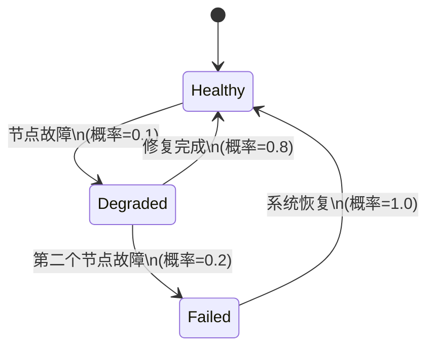

# PRISM 模型设计模式

## 引言

在概率模型检查领域，良好的模型设计模式能显著提升模型的可读性、可维护性和分析效率。PRISM（Probabilistic Symbolic Model Checker）作为领先的概率模型检查工具，其模型设计模式是初学者必须掌握的核心技能。本章将系统介绍PRISM中常用的设计模式，帮助您构建结构清晰、性能优化的概率模型。

## 基础设计模式

### 1. 模块化设计

PRISM模型通常由多个交互模块组成。模块化设计遵循"高内聚低耦合"原则：

```prism
module Process1
    s1 : [0..2] init 0;
    [action] s1=0 -> 0.8:(s1'=1) + 0.2:(s1'=2);
endmodule

module Process2
    s2 : [0..1] init 0;
    [action] s2=0 -> (s2'=1);
endmodule
```

:::tip 最佳实践
- 每个模块代表系统中的一个逻辑组件
- 使用共享动作实现模块间同步
- 限制全局变量的使用
:::

### 2. 状态编码模式

高效的状态编码能大幅减少模型大小：

```prism
// 低效方式
formula status = (s=0 ? "idle" : (s=1 ? "active" : "failed"));

// 高效方式
const int IDLE = 0;
const int ACTIVE = 1;
const int FAILED = 2;
s : [IDLE..FAILED] init IDLE;
```

## 高级设计模式

### 3. 概率选择模式

处理不确定性的典型模式：

```prism
module Sensor
    reading : [0..100] init 0;
    // 正态分布近似
    [update] true -> 0.68:(reading'=max(0,min(100,reading+[-5..5])))
                + 0.27:(reading'=max(0,min(100,reading+[-10..5]|reading+[5..10])))
                + 0.05:(reading'=max(0,min(100,reading+[-20..10]|reading+[10..20])));
endmodule
```

### 4. 故障恢复模式

常见于可靠性工程：

```prism
module Server
    state : [0..2] init 0; // 0=运行, 1=降级, 2=故障
    [req] state=0 -> 0.9:(state'=0) + 0.1:(state'=1);
    [req] state=1 -> 0.7:(state'=1) + 0.3:(state'=2);
    [repair] state=2 -> (state'=0);
endmodule
```

## 实际案例：云存储系统

考虑一个具有冗余存储节点的云系统：



对应的PRISM模型：

```prism
const int N = 3; // 总节点数
const int K = 2; // 容错阈值

module CloudStorage
    nodes_working : [0..N] init N;
    
    // 节点故障
    [fail] nodes_working>0 -> (nodes_working'=nodes_working-1);
    
    // 节点恢复
    [repair] nodes_working<N -> (nodes_working'=nodes_working+1);
    
    // 系统状态公式
    formula healthy = nodes_working >= K;
    formula degraded = nodes_working > 0 & nodes_working < K;
    formula failed = nodes_working = 0;
endmodule
```

## 性能优化模式

### 5. 对称性减少

利用对称性简化模型：

```prism
module Process
    p1 : [0..1];
    p2 : [0..1];
    // 对称规则
    [act] p1=p2 -> 0.5:(p1'=1-p1) + 0.5:(p2'=1-p2);
endmodule
```

### 6. 变量分组

优化状态空间：

```prism
// 原始方式
x : [0..10];
y : [0..10];

// 优化方式
group : [0..3] init 0;
formula x = (group=0?5:(group=1?8:(group=2?3:7)));
formula y = (group=0?3:(group=1?7:(group=2?8:5)));
```

## 总结与练习

通过本章学习，您已经掌握了PRISM模型设计的关键模式：

1. 模块化分解复杂系统
2. 高效的状态编码方法
3. 概率选择和故障恢复模式
4. 性能优化技巧

**巩固练习**：
1. 设计一个具有两个冗余组件的通信系统模型
2. 实现一个具有三种故障模式的传感器模型
3. 优化一个现有模型的状态空间表示

**延伸阅读**：
- PRISM官方文档中的"Modeling Tips"部分
- 《Principles of Model Checking》第10章
- 概率模型检查国际会议(PMC)的最新研究成果