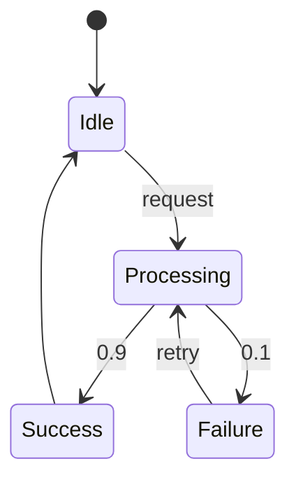

# PRISM 建模风格指南

## 引言

PRISM是一种用于建模和分析概率系统的形式化工具。良好的建模风格能显著提升模型的可读性、可维护性和分析效率。本指南将介绍PRISM语言的关键规范，帮助初学者避免常见陷阱。

:::note 为什么需要风格指南？
- 使模型更易于团队协作
- 减少状态空间爆炸风险
- 提高模型验证效率
- 增强结果的可复现性
:::

## 基础规范

### 1. 命名约定

```prism
// 好的命名示例
const int MAX_RETRIES = 3;
module CommunicationChannel
    sendAttempt : [0..MAX_RETRIES] init 0;
endmodule

// 应避免的命名
const int x = 3;
module m1
    y : [0..x] init 0;
endmodule
```

命名原则：
- 常量使用全大写+下划线
- 模块名使用帕斯卡命名法
- 变量名使用小驼峰命名法
- 避免单字母命名（循环变量除外）

### 2. 模块化设计

```prism
// 通信系统分解示例
module Sender
    [send] !channelReady -> 0.9:(msgSent'=true) + 0.1:(failures'=failures+1);
endmodule

module Channel
    [send] msgSent -> 0.8:(channelReady'=false) & (receiverReady'=true);
endmodule

module Receiver
    [receive] receiverReady -> (ack'=true);
endmodule
```

模块化优势：
- 分离系统组件
- 明确交互接口
- 便于单独测试

## 高级实践

### 3. 状态空间优化



对应PRISM模型：

```prism
module System
    state : [0..2] init 0; // 0=Idle, 1=Processing, 2=Success
    failures : int init 0;

    [request] state=0 -> (state'=1);
    [process] state=1 -> 0.9:(state'=2) + 0.1:(state'=1) & (failures'=failures+1);
    [reset] state=2 -> (state'=0);
endmodule
```

优化技巧：
- 使用枚举代替布尔标志
- 合并等效状态
- 限制整数范围

### 4. 概率表达规范

```prism
// 清晰的概率分布
[retry] failures < MAX_RETRIES 
    -> 0.7:(status'=SUCCESS) 
    + 0.2:(status'=FAILURE) 
    + 0.1:(failures'=failures+1);

// 应避免的形式
[retry] f<3 -> 0.7:s=1 + 0.2:s=0 + 0.1:f=f+1;
```

:::caution 常见错误
- 概率总和不为1
- 使用未归一化的权重
- 忽略隐含的"否则"情况
:::

## 实战案例：缓存系统

```prism
// 分布式缓存系统模型
const int CACHE_SIZE = 3;
const double HIT_RATE = 0.85;

module CacheNode
    cache : array [0..CACHE_SIZE-1] of bool init false;
    hits : int init 0;
    misses : int init 0;

    [access] true 
        -> HIT_RATE:(hits'=hits+1)
        + (1-HIT_RATE):(misses'=misses+1);
    
    [evict] true -> (cache[floor(Uniform(0,CACHE_SIZE))]'=false);
endmodule

// 添加监控属性
rewards "hit_ratio"
    [access] hits/(hits+misses) : 1;
endrewards
```

设计要点：
1. 使用数组表示缓存行
2. 明确概率常数定义
3. 添加性能监控奖励
4. 使用内置分布函数

## 总结与练习

### 关键要点
- 命名应具有自解释性
- 模块职责单一化
- 主动控制状态空间大小
- 验证概率分布完整性

### 巩固练习
1. 将以下模型重构为符合风格指南：
```prism
module m
x:bool init f;
[t]x->0.5:(x'=t)+0.5:(x'=f);
endmodule
```

2. 设计一个具有两个故障模式的传感器模块，要求：
   - 使用枚举类型
   - 包含恢复机制
   - 添加维护奖励

### 扩展资源
- PRISM官方语法手册
- 《概率模型检测》第4章
- 开源案例库：PRISM-games.org
