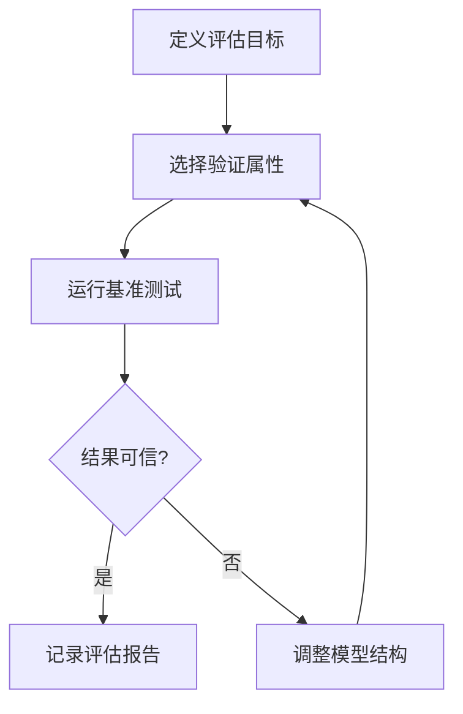

# PRISM 模型质量评估

## 引言

在概率模型检查中，构建模型只是第一步。确保模型的质量（即其准确性和可靠性）同样重要。PRISM模型质量评估涉及验证模型是否正确地反映了目标系统，并检查其输出是否符合预期。本指南将介绍评估PRISM模型质量的关键技术和方法。

## 模型验证 vs. 模型验证

首先，我们需要区分两个关键概念：

- **模型验证（Verification）**：检查模型是否满足给定的规范（例如，“系统永远不会死锁”）。
- **模型验证（Validation）**：检查模型是否准确地代表了现实世界的系统。

PRISM主要通过形式化方法支持**模型验证**，但我们可以通过以下技术间接评估模型质量。

---

## 关键评估技术

### 1. 属性测试

通过定义并检查逻辑属性（如LTL或PCTL公式）来验证模型行为。例如：

```prism
// 检查系统在100步内达到目标状态的概率
P>=0.95 [ F<=100 "success" ]
```

如果验证失败（例如概率实际为0.8），则表明模型可能需要调整。

### 2. 敏感性分析

通过改变参数值观察结果变化，评估模型鲁棒性：

```prism
// 定义可变参数
const double p = 0.1; // 初始值
// ...后文使用p...

// 命令行中测试不同值
prism model.prism -prop property.pctl -param p=0.1:0.9:0.1
```

### 3. 模拟运行

通过模拟轨迹验证模型行为是否符合预期：

```prism
// 在PRISM中生成模拟路径
simulate [ num=1000, time=500 ] { state_var1, state_var2 };
```

---

## 实际案例：网络协议可靠性

假设我们建模一个重传协议，评估其在不同丢包率下的表现：

```prism
// 模型片段
module Sender
    sent : bool init false;
    [] !sent -> p : (sent'=true) + (1-p) : (sent'=false);
endmodule

// 属性：消息在3次尝试内传递的概率
P=? [ F<=3 delivered ]
```

通过以下步骤评估质量：
1. 对 `p=0.7, 0.8, 0.9` 分别验证属性
2. 比较结果与理论计算值
3. 如果偏差>5%，检查模型假设

---

## 常见质量问题

:::warning
遇到这些问题时需重新审视模型：
- **状态空间爆炸**：模型过于详细导致无法分析
- **概率总和≠1**：转移概率定义错误
- **死锁状态**：未覆盖所有可能的系统状态
:::

---

## 评估工作流程



---

## 总结与练习

### 关键要点
- 属性测试是质量评估的核心方法
- 参数敏感性分析揭示模型弱点
- 模拟运行提供直观行为验证

### 练习建议
1. 在PRISM自带示例`coin.prism`中：
   - 添加"连续3次正面"的属性检查
   - 通过模拟验证结果
2. 修改`leader_election.prism`的故障概率：
   - 观察选举成功概率的变化曲线

### 扩展阅读
- PRISM手册中的"Debugging Models"章节
- 《Principles of Model Checking》第10章（MIT Press）