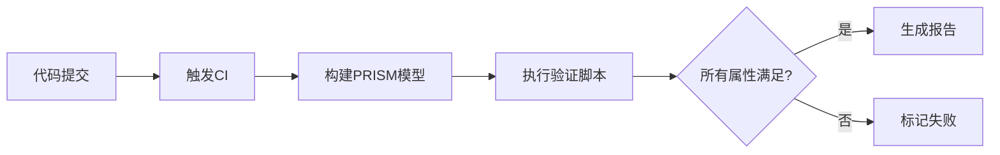

# PRISM 持续验证流程

## 引言

持续验证是概率模型检查中的重要实践，指在模型开发过程中**自动化执行验证任务**，确保每次修改后系统属性仍满足要求。PRISM作为概率符号模型检查器，通过脚本化和批处理功能支持这一流程。

:::tip 为什么需要持续验证？
- 概率模型常需反复调整参数或结构
- 手动验证耗时且容易遗漏
- 可捕获"蝴蝶效应"式的小改动引发的大问题
:::

## 核心组件

### 1. 验证脚本化

PRISM支持通过命令行执行验证任务。基础命令格式：
```bash
prism model.pm properties.pctl -const k=5
```

典型输出示例：
```
Result: 0.9823 (value in the initial state)
Time for model checking: 12.3 seconds
```

### 2. 自动化测试框架集成

创建验证脚本`verify.sh`：
```bash
#!/bin/bash
PRISM_PATH=/path/to/prism/bin

# 验证属性1
$PRISM_PATH/prism traffic.pm safety.pctl > results/safety.txt

# 验证属性2并提取数值
RESULT=$($PRISM_PATH/prism traffic.pm efficiency.pctl | grep "Result:" | awk '{print $2}')

# 阈值检查
if (( $(echo "$RESULT < 0.9" | bc -l) )); then
  echo "验证失败: 效率值 $RESULT 低于阈值" >&2
  exit 1
fi
```

### 3. 持续集成流程



## 实际案例：网络协议验证

**场景**：验证无线传感器网络协议的能耗概率属性

1. 模型文件`protocol.pm`：
```prism
module SensorNode
    energy : [0..100] init 100;
    
    [send] energy>0 -> 0.9:(energy'=energy-10) + 0.1:(energy'=energy-15);
    [receive] energy>0 -> 0.7:(energy'=energy-5);
endmodule
```

2. 属性文件`energy.pctl`：
```prism
P>=0.95 [ F<=100 energy=0 ]
```

3. CI配置示例（GitLab CI）：
```yaml
verify:
  image: prismtool/prism
  script:
    - prism protocol.pm energy.pctl > verification.log
    - grep -q "Result: true" verification.log || exit 1
```

## 最佳实践

:::caution 注意事项
- 始终验证**关键属性子集**而非全部属性以节省时间
- 设置合理的超时限制防止无限验证
- 版本控制中同时保存模型和属性文件
:::

**优化技巧**：
1. 使用`-exportresults`参数导出结构化结果
2. 对大型模型采用`-sim`参数进行模拟验证
3. 通过`-const`参数实现参数化验证

## 总结与进阶

持续验证使PRISM成为**活文档**，其核心价值在于：
- 早期发现设计缺陷
- 确保模型演化中的行为一致性
- 支持基于证据的决策

**推荐练习**：
1. 为简单队列模型创建CI流程
2. 设计验证阈值检查脚本
3. 比较完整验证与模拟验证的结果差异

**扩展阅读**：
- PRISM官方文档《Batch Experiments》
- 《形式化方法在持续集成中的应用》学术论文
- 概率模型检查案例研究库
