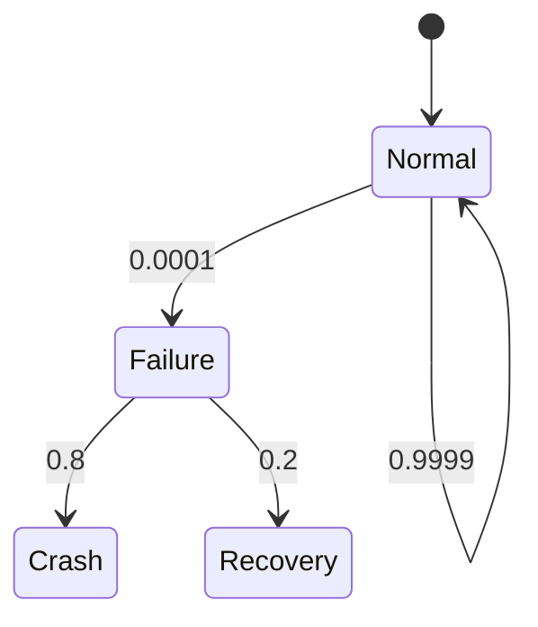

# PRISM 建模伦理与责任

## 引言

PRISM（Probabilistic Symbolic Model Checker）是一个强大的工具，用于分析和验证概率系统的行为。然而，随着能力的增长，责任也随之而来。在建模过程中，我们需要考虑伦理问题，确保模型的应用不会对社会、环境或个人造成负面影响。本章将探讨PRISM建模中的伦理准则和实际应用中的责任。

---

## 为什么伦理与责任重要？

模型检查工具如PRISM可以用于关键系统（如医疗设备、自动驾驶、金融系统）的验证。错误的模型或不当的使用可能导致严重后果：

1. **安全风险**：模型缺陷可能隐藏系统漏洞。
2. **偏见传播**：概率模型可能放大数据中的偏见。
3. **隐私问题**：模型可能泄露敏感信息。

:::caution
忽视伦理可能导致法律纠纷、声誉损失或直接危害用户安全。
:::

---

## 核心伦理原则

### 1. 透明性
模型的行为和假设必须清晰可解释。例如：
```prism
// 不透明的模型（避免）
module hidden_process
    x : [0..1] init 0;
    [] x=0 -> 0.5:(x'=1) + 0.5:(x'=0);
endmodule

// 透明的模型（推荐）
module transparent_process
    // 明确注释概率转移的含义
    x : [0..1] init 0;
    // 公平硬币翻转
    [] x=0 -> 0.5:(x'=1) + 0.5:(x'=0);
endmodule
```

### 2. 公平性
避免在模型中引入偏见。例如，在资源分配模型中：
```prism
// 有偏见的分配（避免）
rewards "unfair_allocation"
    true : (group=1)? 10 : 1;
endrewards

// 公平分配（推荐）
rewards "fair_allocation"
    true : 5; // 均等分配
endrewards
```

### 3. 可问责性
记录建模决策和验证结果。使用PRISM的注释功能：
```prism
/*
 * 模型作者：Jane Doe
 * 验证目标：确保系统故障率<0.001%
 * 最后更新：2023-10-01
 */
```

---

## 实际案例研究

### 案例：自动驾驶刹车系统
假设我们建模一个概率性刹车系统：



伦理考量：
1. 必须明确标注0.0001故障率的依据
2. 需要验证极端场景（如雨雪天气）
3. 公开测试结果中的限制条件

:::note
实际部署前应进行：
- 第三方审计
- 现实场景测试
- 风险影响评估
:::

---

## 责任检查清单

| 步骤 | 检查项 |
|------|--------|
| 1    | 模型假设是否明确记录？ |
| 2    | 是否验证过边界条件？ |
| 3    | 概率参数是否有可靠数据支持？ |
| 4    | 是否考虑弱势群体影响？ |
| 5    | 是否有应急计划应对模型失败？ |

---

## 总结与练习

### 关键点总结
- 透明性 > 模型性能
- 公平性需要主动设计
- 文档与审计不可或缺

### 练习建议
1. 修改一个现有PRISM模型，添加完整的伦理注释
2. 设计一个检查表验证你的模型伦理合规性
3. 模拟一个有偏见的模型并分析其影响

### 扩展阅读
- IEEE标准《模型验证伦理指南》
- PRISM官方文档中的验证案例
- ACM《负责任算法设计原则》

通过遵循这些准则，你将成为更负责任的PRISM建模者！