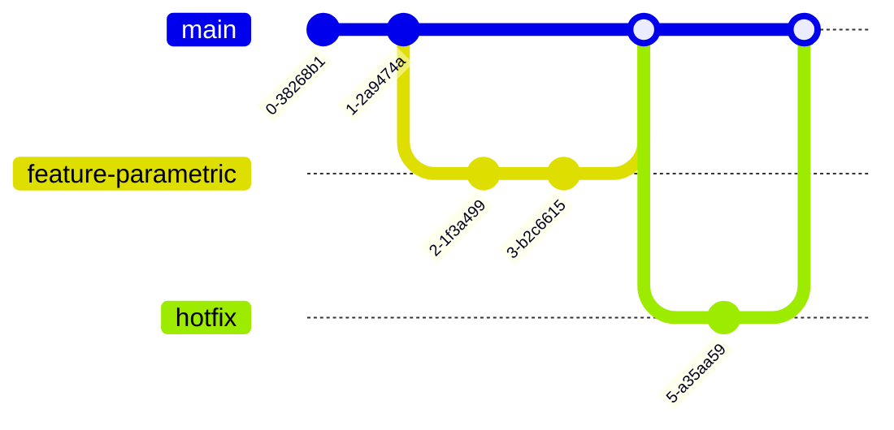

# PRISM 模型版本控制

## 引言

版本控制是软件开发中管理代码变更的核心实践，同样适用于PRISM概率符号模型检查器的建模工作。通过版本控制，您可以：

- 跟踪模型文件的修改历史
- 协作开发时解决冲突
- 回退到早期版本
- 维护不同功能分支

## 为什么PRISM项目需要版本控制

PRISM模型通常由以下文件组成：
```plaintext
project/
  ├── model.pm       # PRISM 模型定义
  ├── properties.pctl # 待验证的属性
  ├── constants.txt  # 模型常数定义
  └── results/       # 验证结果输出
```

这些文件的演变过程需要系统化管理，特别是当：
- 团队协作开发模型
- 需要试验不同参数配置
- 模型复杂度随时间增长

## 基础版本控制实践

### 1. 初始化版本库
```bash
# 在项目目录中初始化Git仓库
git init
git add model.pm properties.pctl constants.txt
git commit -m "Initial PRISM model structure"
```

### 2. 合理的提交消息
使用[约定式提交](https://www.conventionalcommits.org/)风格：
```
feat(model): 添加故障恢复模块
fix(properties): 修正LTL公式语法错误
docs: 更新实验参数说明
```

### 3. 忽略非必要文件
创建`.gitignore`文件：
```gitignore
/results/*.txt
*.tra
__pycache__
```

## 高级工作流程

### 分支策略


典型分支用途：
- `main`：稳定版本
- `feature/*`：新功能开发
- `experiment/*`：参数实验

## 实际案例：可靠性模型迭代

初始模型 (`v1.0`):
```prism
// 基本组件故障率
const double lambda = 0.001;

module Component
  state : [0..1] init 0;
  [up] state=0 -> lambda : (state'=1) + (1-lambda) : (state'=0);
endmodule
```

改进版本 (`v1.1`) 添加冗余：
```prism
// 添加冗余配置
const int N = 2; // 冗余组件数

module RedundantComponent
  components : [0..N] init N;
  [up] components>0 -> 
    components*lambda : (components'=components-1);
endmodule
```

:::tip 版本对比技巧
使用`git diff`查看变更：
```bash
git diff v1.0..v1.1 model.pm
```
:::

## 协作开发注意事项

1. **冲突解决**：模型参数变更常导致冲突
   ```prism
   <<<<<<< HEAD
   const double T = 1000; // 任务周期
   =======
   const double T = 500; // 实验周期
   >>>>>>> dev-branch
   ```

2. **原子提交**：每个提交应包含完整逻辑变更
   ```
   [错误示范]
   - 提交1：添加新状态变量
   - 提交2：添加相关转移概率
   - 提交3：修正语法错误

   [正确示范]
   - 单次提交：完成新状态模块添加
   ```

## 工具集成

### 1. PRISM与Git结合工作流


### 2. 持续集成示例 (GitHub Actions)
```yaml
name: PRISM Verification
on: [push]

jobs:
  verify:
    runs-on: ubuntu-latest
    steps:
    - uses: actions/checkout@v2
    - name: Install PRISM
      run: sudo apt-get install prism
    - name: Verify model
      run: prism model.pm properties.pctl
```

## 总结与练习

### 关键要点
- 版本控制应成为PRISM建模的标准实践
- 提交应保持原子性和描述性
- 分支策略应根据项目复杂度调整

### 练习建议
1. 为现有PRISM项目初始化Git仓库
2. 创建实验分支修改参数，比较不同版本结果
3. 模拟团队协作场景下的合并冲突解决

### 扩展阅读
- [Git官方文档](https://git-scm.com/doc)
- [PRISM项目结构指南](https://prismmodelchecker.org/manual/)
- [科研代码管理最佳实践](https://doi.org/10.1145/3426426.3426478)