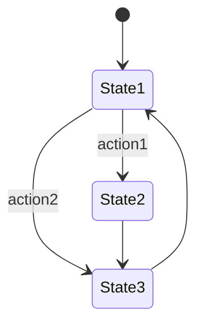

# PRISM 大型项目管理

## 引言

当使用PRISM进行复杂系统的概率模型验证时，项目规模可能迅速增长到难以管理的程度。本文将介绍如何通过模块化设计、性能优化和协作策略来有效管理大型PRISM项目，帮助初学者避免常见陷阱。

## 模块化设计

### 1. 模型分解原则

将大型模型分解为逻辑模块是管理复杂性的关键：

```prism
// 示例：网络协议模块化设计
module Client
    s : [0..3] init 0;
    [request] s=0 -> 0.8:(s'=1) + 0.2:(s'=2);
    [response] s=1 -> (s'=3);
endmodule

module Server
    r : [0..2] init 0;
    [request] r=0 -> (r'=1);
    [response] r=1 -> 0.9:(r'=0) + 0.1:(r'=2);
endmodule
```

:::tip 模块化优势
- 提高代码可读性
- 支持并行开发
- 便于单独测试组件
:::

### 2. 接口规范

定义清晰的模块接口变量：

```prism
// 全局同步变量
global request : bool init false;
global response : bool init false;
```

## 性能优化策略

### 1. 状态空间缩减

```prism
// 使用公式减少状态
formula connected = (node1.status=active & node2.status=active);
```

### 2. 对称性利用



:::note 性能提示
对于对称系统，考虑使用PRISM的对称性缩减选项：
`prism model.pm -symm`
:::

## 版本控制与协作

### 1. 文件组织建议

```
/project-root
│── /models
│   ├── protocol.prism
│   ├── environment.prism
│   └── properties.csl
│── /results
│── README.md
```

### 2. Git最佳实践

```bash
# 典型工作流程
git checkout -b feature/module-xyz
git add models/module_xyz.prism
git commit -m "Add network reliability module"
git push origin feature/module-xyz
```

## 实际案例：分布式系统验证

### 场景描述
验证一个由5个节点组成的P2P网络的消息传播可靠性。

### 解决方案
1. 为每个节点创建独立模块
2. 定义消息传播的全局变量
3. 分层验证属性：

```prism
// 节点模块示例
module Node1
    received : bool init false;
    [broadcast] !received -> 0.95:(received'=true);
endmodule

// 系统级属性
P>=0.99 [ F<=100 all_nodes_received ]
```

## 调试与维护

### 1. 增量验证策略

```prism
// 先验证2节点系统
const int N = 2;
// 逐步增加到5个节点
```

### 2. 日志记录技巧

```prism
// 添加调试标签
label "debug_state" = (s1=3 & s2=1);
```

:::caution 常见错误
避免在大型模型中使用完全同步的`[]`动作，这会导致状态爆炸。
:::

## 总结

管理大型PRISM项目需要：
- 严格的模块化设计
- 早期性能规划
- 团队协作规范
- 渐进式验证方法

## 延伸学习

1. PRISM官方文档中的"Large Models"章节
2. 尝试将一个现有小项目重构为模块化结构
3. 使用`-exportstates`选项分析状态空间增长

通过系统性地应用这些实践，你将能够有效地扩展PRISM项目规模，同时保持代码的可维护性和验证效率。