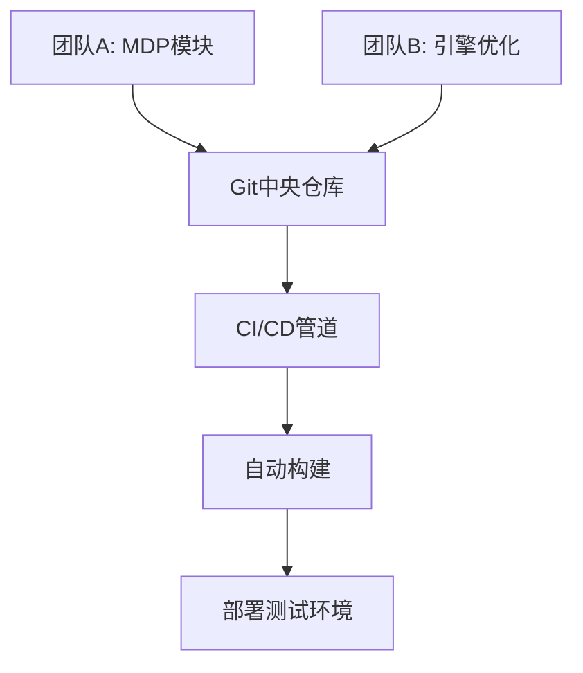

# PRISM 团队协作策略

## 介绍

在PRISM（Probabilistic Symbolic Model Checker）项目中，团队协作是确保项目成功的关键因素。无论是学术研究还是工业应用，多人协作时的高效沟通和代码管理能够显著提升模型验证的准确性和开发效率。本章将介绍PRISM团队协作的核心策略，帮助初学者快速掌握协作技巧。

---

## 1. 版本控制与Git集成

版本控制是团队协作的基础。使用Git管理PRISM项目可以追踪代码变更、合并冲突并保留历史记录。

### 基本工作流程
1. **初始化仓库**：
   ```bash
   git init
   git remote add origin <repository-url>
   ```

2. **分支策略**：
   - `main`分支用于稳定版本。
   - 为每个功能或修复创建独立分支（例如 `feature/optimize-model`）。

:::tip
使用语义化分支命名（如 `fix/bug-123` 或 `feature/dtmc-support`）便于团队理解变更内容。
:::

---

## 2. 模块化设计

将PRISM模型分解为模块，便于多人并行开发和维护。

### 示例：模块化PRISM模型
```prism
// 模块1：定义环境行为
module Environment
    x : [0..10] init 0;
    [action] x < 10 -> (x' = x + 1);
endmodule

// 模块2：定义智能体行为
module Agent
    y : bool init false;
    [action] !y -> (y' = true);
endmodule
```

**优势**：
- 团队成员可独立负责不同模块
- 减少合并冲突
- 便于单元测试

---

## 3. 代码审查流程

通过Pull Request（PR）确保代码质量：

1. 开发者推送分支后创建PR
2. 团队成员审查：
   - 检查模型逻辑正确性
   - 验证概率计算准确性
3. 使用CI工具（如GitHub Actions）自动运行测试

:::note
PRISM项目建议至少需要**两人**批准才能合并代码。
:::

---

## 4. 文档规范

### 4.1 模型注释
```prism
// @author: Alice
// @description: DTMC模型示例
// @last-updated: 2023-10-01
module Example
    s : [0..1] init 0;
    [] s=0 -> 0.5:(s'=1) + 0.5:(s'=0); // 概率转移
endmodule
```

### 4.2 变更日志
维护`CHANGELOG.md`记录重大修改：
```markdown
## 1.1.0 - 2023-10-01
### Added
- 新增DTMC模板库
```

---

## 5. 实际案例：分布式团队项目

### 场景描述
- 团队A（柏林）：开发马尔可夫决策过程模块
- 团队B（东京）：优化概率计算引擎
- 共享组件：结果可视化工具

### 协作流程图


---

## 总结

| 策略                | 关键工具/方法          | 优势                     |
|---------------------|-----------------------|-------------------------|
| 版本控制            | Git + 分支策略        | 变更追踪，减少冲突       |
| 模块化设计          | PRISM模块系统         | 并行开发，易于维护       |
| 代码审查            | Pull Request流程      | 提高代码质量             |
| 文档标准化          | 注释 + 变更日志       | 知识传承，审计追踪       |

## 延伸练习

1. 在GitHub上创建一个PRISM项目模板仓库
2. 与同伴合作实现一个包含3个模块的MDP模型
3. 实践一次完整的PR审查流程

## 附加资源

- [PRISM官方文档 - 团队项目](http://www.prismmodelchecker.org/manual/)
- [Git团队协作工作流指南](https://git-scm.com/book/en/v2)