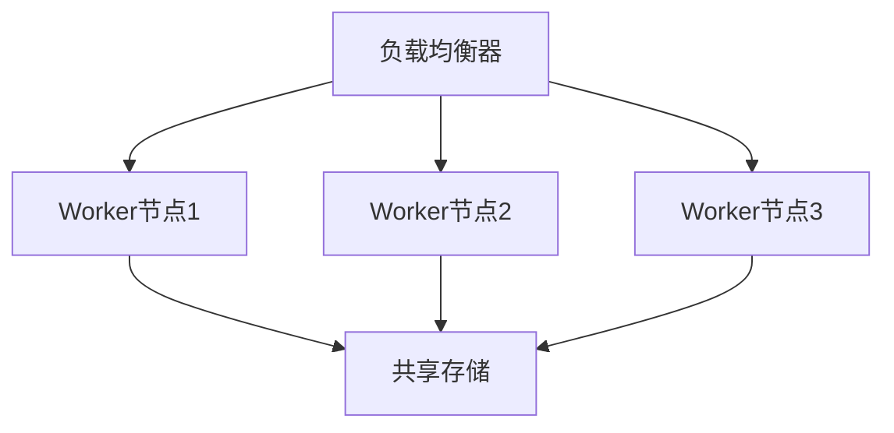

# PRISM 模型复用技术

## 介绍

在PRISM概率模型检查器的使用过程中，**模型复用技术**是提升开发效率的关键策略。通过模块化设计和参数化建模，我们可以创建可重用的模型组件，避免重复劳动，并确保模型的一致性和可维护性。

模型复用主要涉及以下三个核心方面：
1. **模板化建模**：创建通用模型结构
2. **参数传递**：通过参数实现模型定制
3. **模块组合**：将独立验证的模块组装成复杂系统

## 基础复用技术

### 1. 常量定义复用

使用PRISM的`const`关键字定义全局常量，可在多个模型间共享：

```prism
// 共享常量定义
const int MAX_CONN = 10;  // 最大连接数
const double FAIL_RATE = 0.01; // 故障率

module Network
    connections : [0..MAX_CONN] init 0;
    [connect] connections < MAX_CONN -> (connections'=connections+1);
endmodule
```

### 2. 参数化模块

通过参数创建通用模块模板：

```prism
module GenericQueue(queueSize)
    items : [0..queueSize] init 0;
    
    [enqueue] items < queueSize -> (items'=items+1);
    [dequeue] items > 0 -> (items'=items-1);
endmodule

// 实例化两个不同大小的队列
module SmallQueue = GenericQueue(5) endmodule
module LargeQueue =GenericQueue(20) endmodule
```

## 高级复用模式

### 1. 模型包含技术

使用`include`指令复用模型片段：

```prism
// File: shared_components.prism
module FailureModule
    [fail] true -> FAIL_RATE : (state'=failed) + (1-FAIL_RATE) : (state'=working);
endmodule

// 主模型文件
include "shared_components.prism"
module MainSystem
    // 使用共享的FailureModule
    component = FailureModule;
endmodule
```

### 2. 模板继承体系

构建模块继承关系：

```prism
module BaseProcessor
    taskCount : [0..10] init 0;
    [receive] taskCount < 10 -> (taskCount'=taskCount+1);
endmodule

module FastProcessor extends BaseProcessor
    [process] taskCount > 0 -> 0.8 : (taskCount'=taskCount-1);
endmodule

module ReliableProcessor extends BaseProcessor
    [process] taskCount > 0 -> 0.99 : (taskCount'=taskCount-1);
endmodule
```

## 实际案例：云计算系统建模

让我们通过一个云服务器集群的案例展示模型复用：



对应的PRISM模型：

```prism
// 定义共享参数
const int NODE_COUNT = 3;
const double NODE_FAILURE = 0.001;

// 通用节点模块
module GenericNode(nodeId)
    status : [0..1] init 1; // 0=down, 1=up
    [fail] status=1 -> NODE_FAILURE : (status'=0);
    [repair] status=0 -> 0.1 : (status'=1);
endmodule

// 负载均衡器
module LoadBalancer
    [dispatch] true -> 1/NODE_COUNT; // 均匀分发
endmodule

// 实例化节点
module Node1 = GenericNode(1) endmodule
module Node2 = GenericNode(2) endmodule
module Node3 = GenericNode(3) endmodule
```

## 验证与调试技巧

:::tip 复用模型验证
1. 先独立验证基础模块
2. 使用PRISM的`-sim`参数进行模拟测试
3. 逐步组合模块并验证接口一致性
:::

常见错误处理：

```prism
// 错误示例：参数不匹配
module WrongExample = GenericNode // 缺少参数

// 正确写法
module CorrectExample = GenericNode(1) endmodule
```

## 总结与练习

**关键要点总结**：
- 使用`const`定义可配置参数
- 通过参数化模块创建模板
- 利用`include`实现跨模型复用
- 构建模块继承体系提高抽象层次

**实践练习**：
1. 创建一个可复用的缓存模块，包含大小参数和命中率参数
2. 构建包含3个实例的缓存系统模型
3. 验证不同缓存大小对系统性能的影响

**扩展阅读**：
- PRISM官方文档中的"Modules and Composition"章节
- 模型驱动工程(MDE)中的组件化设计原则
- 概率模型检查中的模块化验证技术