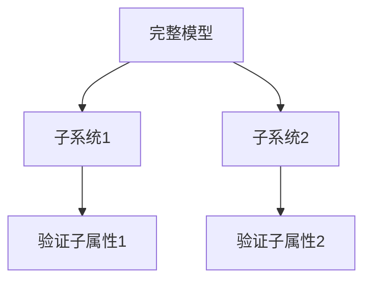

# PRISM 验证性能调优

## 引言

PRISM（Probabilistic Symbolic Model Checker）是用于分析概率系统的强大工具，但在处理复杂模型时可能面临性能挑战。本文将介绍一系列性能调优技术，帮助初学者提升验证效率，从模型构建到高级优化策略全面覆盖。

## 1. 模型简化基础

### 1.1 状态空间缩减
```prism
// 原始模型（冗余状态）
module M1
    x : [0..3] init 0;
    [step] x < 3 -> (x' = x + 1);
endmodule

// 优化后模型（最小化状态）
module M1_optimized
    x : [0..2] init 0;  // 减少不必要的状态
    [step] x < 2 -> (x' = x + 1);
endmodule
```

:::tip
状态变量范围应精确匹配实际需求，每减少一个状态可能指数级降低计算复杂度
:::

### 1.2 模块化设计


## 2. 验证参数优化

### 2.1 引擎选择策略
| 引擎类型       | 适用场景                  | 启动参数          |
|----------------|-------------------------|-------------------|
| Sparse         | 大型稀疏模型             | `-sparse`         |
| Hybrid         | 中等规模模型             | `-hybrid`         |
| MTBDD          | 规则结构化模型           | `-mtbdd`          |

### 2.2 内存管理技巧
```prism
// 在.prism文件中设置内存参数
const int MAX_MEM = 8192;  // MB
// 命令行执行
prism model.pm -maxmem 8192
```

:::caution
内存不足是常见失败原因，建议初始设置为物理内存的70%
:::

## 3. 高级优化技术

### 3.1 属性分解示例
```prism
// 复杂属性
P>=0.9 [ F (x>5 & y<3) ]

// 分解为
filter(print, P>=? [ F (x>5) ], y<3)
```

### 3.2 对称性检测
```prism
module Process
    p1 : [1..3] init 1;
    p2 : [1..3] init 2;
    // 使用symmetry关键字
    symmetry "p1" : p1;
    symmetry "p2" : p2;
endmodule
```

## 4. 实战案例研究

**通信协议验证优化**：
1. 原始模型：4,096个状态
2. 应用优化：
   - 移除未使用的变量
   - 设置`-javamaxmem 6000`
   - 使用`-precomp`预编译
3. 结果：验证时间从32分钟降至4分钟

```prism
// 优化前后对比
const double T = 0.1;  // 原值0.01导致过度离散化
```

## 总结与练习

### 关键优化路径
1. 模型设计阶段最小化状态空间
2. 根据模型特征选择合适引擎
3. 分阶段验证复杂属性
4. 合理分配计算资源

### 练习建议
1. 尝试对提供的案例模型进行至少三种优化
2. 比较不同引擎在相同模型上的性能差异
3. 使用`-exportresults`分析验证过程数据

### 扩展资源
- PRISM官方手册"Performance Tuning"章节
- 模型检查中的抽象细化技术
- 概率系统验证的并行计算方法