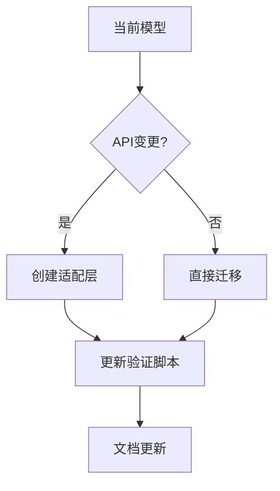

# PRISM 模型维护策略

## 介绍

在概率模型检查工具PRISM中，模型维护是确保长期项目可管理性的关键。良好的维护策略能帮助您：
- 减少模型复杂度
- 提高团队协作效率
- 快速定位和修复问题
- 保证模型在不同PRISM版本间的兼容性

## 核心维护策略

### 1. 版本控制集成

所有PRISM模型文件（`.prism`）应纳入版本控制系统（如Git）：

```bash
# 典型PRISM项目目录结构
models/
  ├── system.prism
  ├── environment.prism
  └── requirements.props
tests/
  └── verification_scripts.sh
docs/
  └── design_notes.md
```

:::tip
为每个模型文件添加头部注释说明用途和修改历史：
```
// Model: SensorNetwork.prism
// Description: Wireless sensor network reliability model
// Last Updated: 2023-11-20 by Alice
```
:::

### 2. 模块化设计

将大型模型分解为可复用的模块：

```prism
// 主系统模型（system.prism）
module System
  s : [0..3] init 0;
  [act] s=0 -> 0.8:(s'=1) + 0.2:(s'=2);
endmodule

// 环境模型（environment.prism）
module Environment
  e : bool init false;
  [act] e=false -> 0.1:(e'=true);
endmodule

// 组合模型
system "System || Environment" endsystem
```

### 3. 自动化验证

创建验证脚本确保模型修改不会破坏现有功能：

```bash
#!/bin/bash
# tests/run_verification.sh
prism models/system.prism models/requirements.props \
  -prop 1 -sim -simpath 1000 > test_results.log
```

### 4. 参数化建模

使用常量代替硬编码值，便于维护：

```prism
const double FAILURE_RATE = 0.05;
const int MAX_RETRIES = 3;

module Communication
  retries : [0..MAX_RETRIES] init 0;
  [send] retries<MAX_RETRIES -> 
    (1-FAILURE_RATE):(retries'=0) 
    + FAILURE_RATE:(retries'=retries+1);
endmodule
```

## 实际案例：通信协议维护

**场景**：维护一个无线通信协议的PRISM模型，需要添加新的错误恢复机制。

1. **创建分支**：
   ```bash
   git checkout -b error-recovery-feature
   ```

2. **添加新模块**：
   ```prism
   // recovery.prism
   module Recovery
     recovery_active : bool init false;
     [failure] !recovery_active -> (recovery_active'=true);
     [recover] recovery_active -> 0.9:(recovery_active'=false);
   endmodule
   ```

3. **更新主模型**：
   ```prism
   system "System || Environment || Recovery" endsystem
   ```

4. **添加验证属性**：
   ```prism
   // requirements.props
   "Recovery Success" : P>=0.95 [ F<=100 !recovery_active ]
   ```

5. **运行回归测试**：
   ```bash
   ./tests/run_verification.sh
   ```

## 模型演化策略

当PRISM版本更新时：



## 总结

有效维护PRISM模型需要：
- 严格的版本控制实践
- 清晰的模块化架构
- 自动化验证流程
- 详实的文档记录

## 延伸练习

1. 将一个现有PRISM模型拆分为至少三个模块
2. 创建验证脚本检查模型的基本性质
3. 尝试在不同PRISM版本间迁移简单模型

## 附加资源

- PRISM官方文档中的模型规范章节
- Git版本控制最佳实践指南
- 软件工程中的模块化设计原则