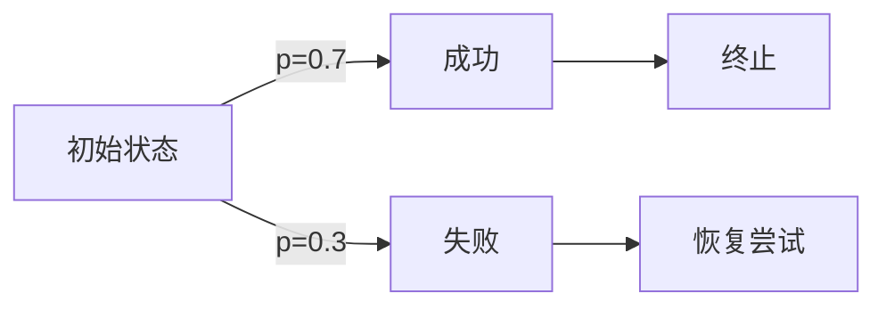

# PRISM 结果报告标准

## 引言

PRISM作为概率模型检查工具，其输出结果包含丰富但复杂的信息。规范的报告标准能帮助您：
- 准确传达验证结论
- 重现实验过程
- 有效比较不同模型版本
- 满足学术/工业场景的文档要求

## 基础报告结构

### 1. 元数据记录
每个报告应包含：
```prism
// 模型基本信息
model: "DTMC Crowds Protocol"
parameters: N=3, T=2
properties: P=? [ F "leak" ]
```

### 2. 核心结果呈现
标准三要素表格：

| 属性类型       | 表达式                     | 结果值       |
|----------------|---------------------------|-------------|
| 概率查询       | `P=? [ F "leak" ]`        | 0.3125      |
| 期望值         | `R{"time"}=? [ F done ]`  | 8.7 steps   |
| 敏感性分析     | `param N in [2..5]`       | 斜率 +0.2   |

## 高级报告技巧

### 结果可视化
使用PRISM的图形输出功能：
```prism
// 生成概率分布图
result -> plot("P vs N");
```



### 置信区间报告
当使用模拟验证时：
:::note
模拟结果应包含：
- 95%置信区间 `[0.28, 0.34]`
- 样本数量 10,000次
- 相对误差 `<5%`
:::

## 实际案例：云服务SLA验证

**场景**：验证云服务的可用性承诺：
```prism
// 模型参数
const double MTBF=120;  // 平均故障间隔(小时)
const double MTTR=2;    // 平均修复时间(小时)

// 验证属性
P>=0.99 [ F<=24h "operational" ]
```

**标准报告应包含**：
1. 参数敏感性分析
2. 不同时间范围内的达标概率
3. 资源消耗统计（内存/时间）

## 常见错误规避

:::caution
避免这些错误：
- 未记录PRISM版本号（不同版本结果可能不同）
- 忽略`--seed`参数（影响随机算法）
- 未说明实验环境（CPU/RAM配置）
:::

## 总结与练习

**关键要点**：
- 结果报告需要具备完整性和可复现性
- 数值结果应配合统计显著性说明
- 可视化能显著提升结果可读性

**练习任务**：
1. 对NAND闪存耐久性模型生成标准报告
2. 比较DTMC和CTMC对同一属性的验证差异
3. 创建包含3种不同参数组合的敏感性报告

**延伸阅读**：
- PRISM官方文档《Results Interpretation》
- ACM模板《实验性论文结果章节写作指南》