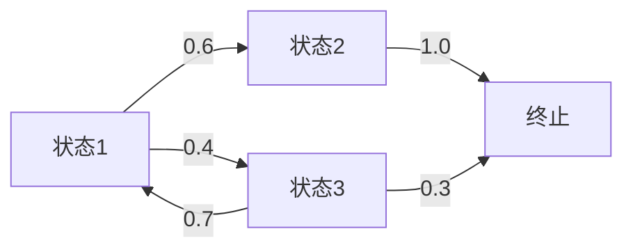

# PRISM 离散时间马尔可夫链(DTMC)

## 引言

离散时间马尔可夫链（Discrete-Time Markov Chain, DTMC）是PRISM支持的四种核心模型类型之一，用于描述**状态在离散时间步上的概率转移系统**。DTMC的特点是**无记忆性**（Markov性质）：下一状态仅取决于当前状态，与历史路径无关。本节将介绍DTMC的数学定义、PRISM语法及典型应用场景。

## 基本概念

### 数学定义
DTMC是一个元组 $(S, \mathbf{P}, s_{init})$，其中：
- $S$：有限状态集合
- $\mathbf{P}: S \times S \rightarrow [0,1]$：转移概率矩阵，满足 $\sum_{s' \in S} \mathbf{P}(s,s')=1$
- $s_{init}$：初始状态

### 可视化示例


## PRISM 中的DTMC语法

### 基础模型结构
PRISM使用模块（`module`）和命令（`command`）定义DTMC：
```prism
dtmc

module Example
    s : [1..3] init 1;  // 状态变量（范围1-3，初始值1）

    [] s=1 -> 0.6:(s'=2) + 0.4:(s'=3);  // 转移命令
    [] s=2 -> 1.0:(s'=4);
    [] s=3 -> 0.7:(s'=1) + 0.3:(s'=4);
endmodule
```

### 关键元素说明
1. **`dtmc`**：声明模型类型
2. **`module`**：封装状态变量和转移逻辑
3. **`[]`**：无条件的动作标签（DTMC中通常为空）
4. **`->`**：转移概率分配，格式为 `prob:(state_update)`

:::note 概率约束
所有转移概率必须：
- 在0到1之间
- 同一命令的所有分支概率之和为1
:::

## 实际案例：网络传输协议

### 场景描述
模拟一个简单的数据包重传协议：
1. 数据包首次发送成功概率：0.8
2. 失败后最多重试2次，每次成功概率降低0.1
3. 最终丢弃概率随失败次数增加

### PRISM 模型
```prism
dtmc

module Protocol
    attempts : [0..2] init 0;  // 重试次数
    status : [0..2];  // 0=发送中, 1=成功, 2=丢弃

    // 首次发送
    [] attempts=0 -> 0.8:(status'=1) + 0.2:(attempts'=1);
    
    // 第一次重试
    [] attempts=1 -> 0.7:(status'=1) + 0.3:(attempts'=2);
    
    // 第二次重试
    [] attempts=2 -> 0.6:(status'=1) + 0.4:(status'=2);
endmodule
```

### 属性验证示例
验证"最终成功接收的概率"：
```prism
P=? [ F status=1 ]
```
输出结果应为 `0.8 + 0.2*0.7 + 0.2*0.3*0.6 = 0.956`

## 常见问题解决

:::caution 概率总和错误
若出现`Probabilities sum to 0.95 (should be 1)`错误，检查：
1. 是否遗漏转移分支
2. 浮点数精度问题（建议使用分数形式如`3/10`）
:::

## 总结与练习

### 关键点回顾
- DTMC适用于离散步骤的概率系统建模
- PRISM通过模块化语法描述状态转移
- 验证概率属性使用`P=? [ F "目标" ]`形式

### 进阶练习
1. 扩展网络协议案例，增加超时机制
2. 建模一个三状态的天气预测系统（晴/雨/阴）
3. 验证"在10步内达到目标状态"的概率属性

### 扩展资源
- PRISM官方手册：DTMC章节
- 《Principles of Model Checking》第10章
- 斯坦福大学CS359G课程讲义
``` 

注意：实际使用时请移除最外层的```mdx