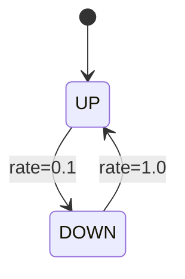

# PRISM 连续时间马尔可夫链(CTMC)

## 引言
连续时间马尔可夫链（Continuous-Time Markov Chain, CTMC）是PRISM支持的三种核心模型类型之一，用于建模具有**连续时间**特性的随机系统。与离散时间模型（DTMC/MDP）不同，CTMC中状态转移的延迟是**指数分布**的随机变量，适用于描述现实中的队列系统、化学反应或网络协议等场景。

## 基本概念
### 1. CTMC的特性
- **状态与转移**：系统由一组状态和状态间的转移组成。
- **指数分布**：每个转移的延迟时间服从指数分布，由**速率参数**（rate）决定。
- **无记忆性**：当前状态决定未来行为，与历史路径无关（马尔可夫性质）。

### 2. PRISM中的CTMC语法
在PRISM中，CTMC模型使用 `ctmc` 关键字定义，转移通过 `[]` 和 `->` 表示，速率写在转移动作后：

```prism
ctmc

module M
    s : [0..2] init 0;

    [transition1] s=0 -> 1.5: (s'=1); // 速率1.5
    [transition2] s=1 -> 0.7: (s'=2);
endmodule
```

### 3. 速率与概率
- 速率（rate）的倒数表示平均转移时间（如 `rate=2` 则平均耗时0.5秒）。
- 从同一状态出发的多个转移的**概率分配**由其速率比例决定。例如：
  - 状态A有两条转移，速率分别为 `2.0` 和 `3.0`，则选择概率为 `2/(2+3)` 和 `3/(2+3)`。

## 实际案例：服务器故障恢复
假设一个服务器有两种状态：`正常(UP)` 和 `故障(DOWN)`。故障发生速率为 `0.1`（平均每10小时故障一次），修复速率为 `1.0`（平均修复时间1小时）。PRISM模型如下：

```prism
ctmc

module Server
    state : [0..1] init 0; // 0=UP, 1=DOWN

    [fail] state=0 -> 0.1: (state'=1);
    [repair] state=1 -> 1.0: (state'=0);
endmodule
```

通过PRISM可计算稳态概率：
```bash
# PRISM 命令
prism server.pm -pf "S=? [state=0]" 
```
输出可能为 `0.909`，表示服务器长期运行时有约90.9%时间处于正常状态。

## 高级特性
### 1. 并行组合
多个CTMC模块可通过并行组合（`||`）交互：
```prism
// 两个独立的CTMC模块
module Module1
    x : [0..1] init 0;
    [sync] x=0 -> 2.0: (x'=1);
endmodule

module Module2
    y : [0..1] init 0;
    [sync] y=0 -> 3.0: (y'=1);
endmodule
```

### 2. 奖励结构
可为CTMC定义**瞬时奖励**（如故障成本）或**累积奖励**（如运行时间）：
```prism
rewards "cost"
    state=1 : 100; // DOWN状态每小时损失100单位
endrewards
```

## 可视化示例
以下Mermaid图展示了服务器案例的CTMC状态转移：


## 总结
CTMC在PRISM中用于建模连续时间随机过程，通过速率参数和指数分布描述系统动态。典型应用包括：
- 可靠性分析（如硬件故障）
- 性能评估（如网络吞吐量）
- 生化反应模拟

:::tip 练习建议
1. 修改服务器模型的故障速率，观察稳态概率变化。
2. 尝试为CTMC添加第三个状态（如`维护中`），并定义新的转移规则。
:::

## 扩展阅读
- PRISM官方文档：[CTMC Syntax](https://www.prismmodelchecker.org/manual/ThePRISMLanguage/ModelTypes)
- 《Stochastic Model Checking》教科书第4章
