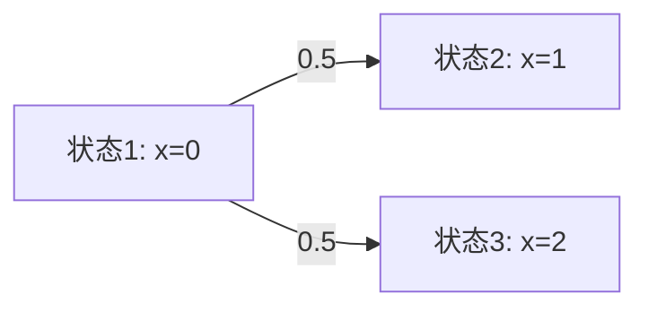
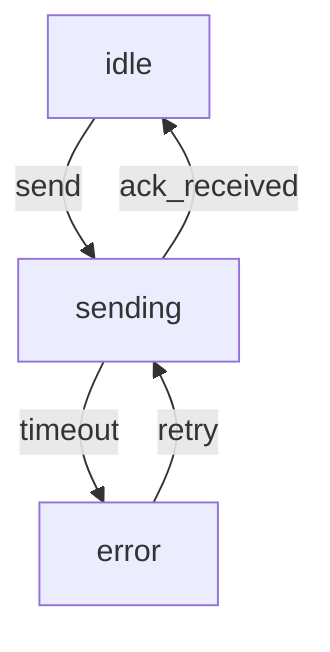

# PRISM 状态空间特性

## 简介

在PRISM概率模型检测器中，**状态空间（State Space）**是模型的核心组成部分，表示系统所有可能的状态及其转移关系。理解状态空间的特性对于分析系统的行为、验证概率性质至关重要。本节将介绍状态空间的基本概念、分类方法以及实际应用中的优化策略。

---

## 状态空间基础

### 什么是状态空间？
状态空间是一个有向图，其中：
- **节点**：表示系统的可能状态（如变量取值、程序计数器位置等）。
- **边**：表示状态之间的转移，通常带有概率或速率标签（如DTMC中的概率或CTMC中的速率）。



### 关键特性
1. **离散性**：PRISM模型的状态空间是离散的（即使建模连续时间行为）。
2. **概率性**：转移可能具有概率或速率（取决于模型类型）。
3. **组合性**：复杂系统的状态空间由多个模块的并行组合生成。

---

## 状态空间的分类

### 1. 有限 vs 无限状态空间
- **有限状态空间**：可通过显式枚举或符号表示（如BDD）处理。
  ```prism
  // 有限状态的DTMC示例
  dtmc
  module M
    x : [0..2] init 0;
    [] x=0 -> 0.5: (x'=1) + 0.5: (x'=2);
    [] x=1 -> 1: (x'=0);
    [] x=2 -> 1: (x'=0);
  endmodule
  ```
- **无限状态空间**：需要抽象技术或近似方法（如参数化模型）。

### 2. 稀疏 vs 稠密状态空间
- **稀疏**：大多数状态只有少量转移（常见于通信协议）。
- **稠密**：状态高度互联（如物理系统模型）。

---

## 状态空间的实际案例

### 案例：简单通信协议
考虑一个重传协议，其状态包括：
- `idle`（空闲）
- `sending`（发送中）
- `wait_ack`（等待确认）
- `error`（错误状态）



对应的PRISM模型片段：
```prism
module Protocol
    state : [0..3] init 0; // 0=idle, 1=sending, 2=wait_ack, 3=error
    [] state=0 -> 0.9: (state'=1) + 0.1: (state'=0);
    [] state=1 -> 0.8: (state'=0) + 0.2: (state'=3);
    [] state=3 -> 1: (state'=1);
endmodule
```

---

## 状态空间爆炸问题

### 原因
当系统包含多个并行组件时，状态空间大小可能呈**指数级增长**。例如：
- 2个布尔变量 → 4种状态
- 10个布尔变量 → 1,024种状态
- 20个布尔变量 → 1,048,576种状态

### 缓解策略
1. **符号表示法**：使用二元决策图（BDD）压缩状态空间。
2. **抽象精化**：忽略不影响验证目标的细节。
3. **对称性减少**：合并对称等价的状态。

:::tip 实践建议
在PRISM中启用`-mtbdd`选项可尝试符号化方法：
```bash
prism model.pm -mtbdd
```
:::

---

## 总结与练习

### 总结
- 状态空间是PRISM模型的行为骨架，由状态和转移组成。
- 分类方式包括有限/无限、稀疏/稠密等。
- 状态空间爆炸是主要挑战，需采用符号化或抽象技术。

### 练习
1. 为以下DTMC绘制状态转移图：
   ```prism
   dtmc
   module Exercise
     s : [0..1] init 0;
     [] s=0 -> 0.7: (s'=1) + 0.3: (s'=0);
     [] s=1 -> 1: (s'=0);
   endmodule
   ```
2. 思考：如果上述模型的`s`范围改为`[0..100]`，状态空间大小是多少？

### 扩展阅读
- PRISM手册中的[“State Space Construction”](http://www.prismmodelchecker.org/manual/)章节。
- 《Principles of Model Checking》第10章（MIT Press）。