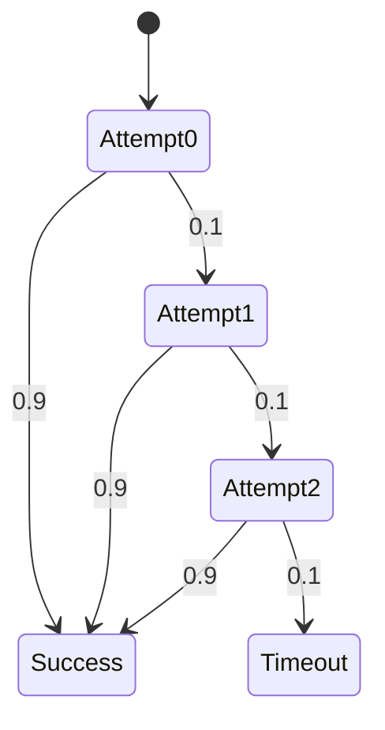

# PRISM 模型合规性检查

## 介绍

在概率模型检查中，**合规性检查**是验证模型是否满足特定规范要求的关键步骤。PRISM作为概率符号模型检查器，允许用户通过形式化规约语言（如PCTL、CSL或LTL）定义属性，并自动验证这些属性在模型中的成立情况。本节将介绍如何在PRISM中执行合规性检查，包括基本语法、实际案例和常见问题。

---

## 合规性检查的基本流程

PRISM的合规性检查通常遵循以下步骤：
1. **定义模型**：使用PRISM建模语言（如DTMC、CTMC或MDP）描述系统行为。
2. **编写规约**：用逻辑公式（如PCTL）表达需要验证的属性。
3. **运行验证**：通过PRISM引擎检查模型是否满足规约。

:::tip
合规性检查的核心是**形式化规约**。例如，"系统在99%的情况下不会死锁"可以表示为 `P>=0.99 [ G !deadlock ]`。
:::

---

## 规约语言示例

PRISM支持多种概率时序逻辑，以下是PCTL的典型用例：

```prism
// 检查"从初始状态出发，最终到达success状态的概率至少为0.9"
P>=0.9 [ F success ]

// 检查"在任意路径上，error状态的最大出现概率不超过0.01"
P<=0.01 [ F error ]
```

### 输入输出示例
**模型文件（model.prism）**:
```prism
dtmc

module System
  state: [0..2] init 0;
  [] state=0 -> 0.6: (state'=1) + 0.4: (state'=2);
  [] state=1 -> 0.7: (state'=0) + 0.3: (state'=2);
endmodule
```

**属性文件（props.pctl）**:
```prism
P>=0.5 [ F state=2 ]
```

**PRISM输出**:
```
Result: true (probability ~0.657)
```

---

## 实际案例：网络协议验证

假设我们需要验证一个重传协议的超时概率是否符合要求：

```prism
// 模型定义（简化版）
mdp

module Protocol
  attempts: [0..3] init 0;
  success: bool init false;

  [retry] !success & attempts<3 -> 0.9: (success'=true) + 0.1: (attempts'=attempts+1);
  [timeout] !success & attempts=3 -> true;
endmodule

// 合规性检查属性
P<=0.001 [ F attempts=3 ]  // 超时概率应≤0.1%
```



---

## 常见问题与调试

1. **不可达状态**：使用 `filter` 命令检查状态空间：
   ```prism
   filter(print, "state=2", P>=0.5 [ F state=2 ])
   ```
2. **概率阈值冲突**：如果PRISM返回 `false`，尝试：
   - 调整概率边界（如将 `P>=0.9` 改为 `P>=0.8`）
   - 检查模型转移概率是否正确

:::caution
确保规约的**时间范围**与模型匹配。例如，CTMC模型可能需要使用 `U<=T` 而非 `U`。
:::

---

## 总结与练习

### 关键点回顾
- 合规性检查通过形式化规约验证模型属性
- PCTL/CSL是PRISM中常用的规约语言
- 实际应用需结合模型类型（DTMC/MDP/CTMC）选择适当逻辑

### 练习建议
1. 修改[网络协议案例](#实际案例网络协议验证)中的重传概率，观察合规性结果变化。
2. 为以下DTMC编写合规性规约：
   ```prism
   dtmc
   module Coin
     face: [0..1] init 0;
     [] face=0 -> 0.5: (face'=0) + 0.5: (face'=1);
     [] face=1 -> 1: (face'=0);
   endmodule
   ```
   要求验证："长期运行中face=1的概率不超过60%"。

### 扩展阅读
- PRISM手册中的[Property Specification](https://www.prismmodelchecker.org/manual/PropertySpecification)
- 《Principles of Model Checking》第10章（概率模型检查）