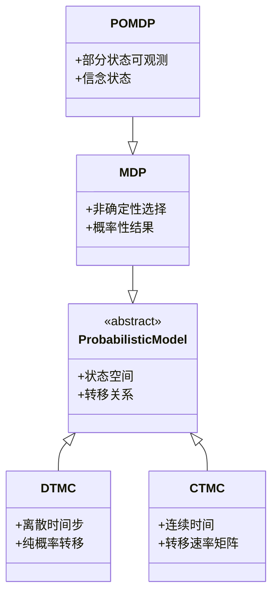
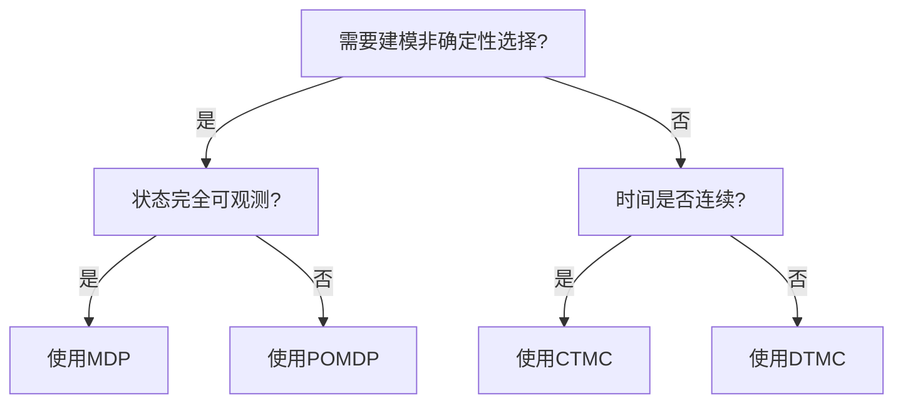

# PRISM 模型比较

## 引言

PRISM作为概率模型检测工具，支持四种基础模型类型：**离散时间马尔可夫链(DTMC)**、**连续时间马尔可夫链(CTMC)**、**马尔可夫决策过程(MDP)**和**部分可观测马尔可夫决策过程(POMDP)**。本指南将通过对比模型结构、时间特性、非确定性等维度，帮助初学者选择适合问题场景的模型类型。

## 核心模型特性对比



### 1. 离散时间马尔可夫链 (DTMC)
- **时间特性**：离散时间步
- **转移方式**：概率转移矩阵 `P(s,s')`
- **典型应用**：协议验证、算法分析

```prism
// 简单DTMC示例：硬币抛掷
dtmc
module Coin
    state : [0..1] init 0; // 0=heads, 1=tails
    [] state=0 -> 0.5 : state'=0 + 0.5 : state'=1;
    [] state=1 -> 0.5 : state'=0 + 0.5 : state'=1;
endmodule
```

### 2. 连续时间马尔可夫链 (CTMC)
- **时间特性**：连续时间（指数分布延迟）
- **转移方式**：转移速率矩阵 `Q(s,s')`
- **典型应用**：性能分析、生化反应

```prism
// 服务器模型CTMC示例
ctmc
module Server
    state : [0..1]; // 0=idle, 1=busy
    [] state=0 -> 2.0 : state'=1; // 到达率2.0
    [] state=1 -> 1.0 : state'=0; // 服务率1.0
endmodule
```

### 3. 马尔可夫决策过程 (MDP)
- **关键特性**：非确定性选择 + 概率结果
- **策略影响**：最优策略求解
- **典型应用**：控制系统、资源调度

```prism
// 机器人导航MDP示例
mdp
module Robot
    x : [0..2] init 0;
    [move] x=0 -> 0.8:x'=1 + 0.2:x'=0;
    [move] x=1 -> 0.7:x'=2 + 0.3:x'=0;
    [done] x=2 -> 1.0:x'=2;
endmodule
```

### 4. 部分可观测MDP (POMDP)
- **特殊特性**：状态不完全可观测
- **解决方案**：信念状态跟踪
- **典型应用**：传感器网络、AI规划

:::note
POMDP模型在PRISM中需要转换为信念MDP进行处理，计算复杂度显著高于其他模型。
:::

## 模型选择决策树



## 实际案例对比

### 案例1：网络协议验证
- **DTMC**：验证固定概率丢包下的传输成功率
- **MDP**：分析不同重传策略的最优行为

### 案例2：医疗决策系统
- **CTMC**：模拟疾病自然进展过程
- **POMDP**：处理不完全的检测结果时制定治疗策略

## 总结与练习

### 关键区别总结
| 特性        | DTMC  | CTMC  | MDP   | POMDP |
|-------------|-------|-------|-------|-------|
| 时间        | 离散  | 连续  | 离散  | 离散  |
| 非确定性    | 无    | 无    | 有    | 有    |
| 可观测性    | 完全  | 完全  | 完全  | 部分  |

### 巩固练习
1. 将以下场景映射到合适模型类型：
   - 智能手机电池消耗模拟
   - 自动驾驶车辆的避障决策
   - 基因调控网络建模

2. 在PRISM中尝试将同一个简单系统（如3状态循环）分别建模为DTMC和CTMC，比较输出结果差异。

## 扩展阅读
- PRISM官方文档《Model Types》章节
- 《Principles of Model Checking》第10章
- 斯坦福大学POMDP教程资料