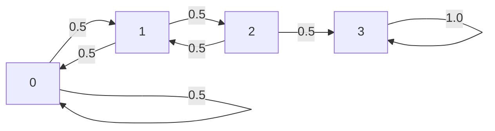

## 介绍

PRISM是一种用于建模和分析概率系统的形式化验证工具。本章将通过具体实例演示如何构建和分析PRISM支持的四种核心模型类型：

1. 离散时间马尔可夫链(DTMC)
2. 连续时间马尔可夫链(CTMC) 
3. 马尔可夫决策过程(MDP)
4. 概率定时自动机(PTA)

我们将从简单模型开始，逐步展示模型定义语法和典型分析场景。

## 1. DTMC实例：简单随机游走

考虑一个在{0,1,2,3}状态空间上的随机游走模型：

```prism
// File: random_walk.prism
dtmc

module RandomWalk
    s : [0..3] init 0;
    
    [] s=0 -> 0.5: (s'=1) + 0.5: (s'=0);
    [] s=1 -> 0.5: (s'=2) + 0.5: (s'=0);
    [] s=2 -> 0.5: (s'=3) + 0.5: (s'=1);
    [] s=3 -> 1: (s'=3);
endmodule
```

### 模型解析：
- `dtmc` 声明模型类型
- `module` 包含状态变量和转移规则
- `s : [0..3]` 定义状态变量及其范围
- `init 0` 设置初始状态
- `[]` 表示无条件转移
- `->` 右侧是转移概率分布

### 状态转移图：



### 典型分析问题：
```prism
// 到达状态3的概率
P=? [ F s=3 ]

// 预期到达步数
R{"steps"}=? [ F s=3 ]
```

:::tip 初学者提示
DTMC中每个时间步必须发生状态转移，所有 outgoing 转移概率之和必须为1
:::

## 2. CTMC实例：化学反应系统

模拟一个简单的化学反应 A + B → C：

```prism
ctmc

const double k = 0.1; // 反应速率常数

module ChemicalReaction
    a : [0..100] init 50; // 分子A数量
    b : [0..100] init 50; // 分子B数量
    c : [0..100] init 0;  // 分子C数量
    
    [reaction] a>0 & b>0 -> k*a*b: (a'=a-1) & (b'=b-1) & (c'=c+1);
endmodule
```

### 关键特性：
- 转移速率取决于当前状态 (k*a*b)
- 时间连续，转移延迟服从指数分布
- 使用 `const` 定义模型参数

### 典型查询：
```prism
// 10秒内生成至少30个C分子的概率
P=? [ F<=10 c>=30 ]

// 预期C分子数量随时间变化
S=? [ c ]
```

## 3. MDP实例：网络协议决策

模拟一个带重传机制的网络协议：

```prism
mdp

const int MAX_RETRY = 3;

module Sender
    msg_sent : bool init false;
    retry : [0..MAX_RETRY] init 0;
    
    [send] !msg_sent -> (msg_sent'=true);
    [timeout] msg_sent & retry<MAX_RETRY -> 0.5: (retry'=retry+1) + 0.5: (msg_sent'=false);
    [ack] msg_sent -> (msg_sent'=false) & (retry'=0);
endmodule
```

### 决策点分析：
- `[send]` 动作由系统主动选择
- `[timeout]` 后的策略选择构成非确定性决策
- 概率与非确定性混合

### 最优策略查询：
```prism
// 最小化重传次数的最大概率
R{"retries"}min=? [ F !msg_sent ]
```

## 4. PTA实例：定时协议验证

验证一个带超时的通信协议：

```prism
pta

const int T = 5; // 超时阈值

module Protocol
    s : [0..2] init 0; // 0:空闲, 1:等待, 2:完成
    x : clock;         // 计时器
    
    [start] s=0 -> (s'=1) & (x'=0);
    [receive] s=1 & x<=T -> (s'=2);
    [timeout] s=1 & x>T -> (s'=0);
    
    invariant
        s=1 => x<=T+1
    endinvariant
endmodule
```

### 时钟约束：
- `clock` 类型变量连续增长
- `invariant` 强制状态不变式
- 守卫条件(`x<=T`)控制时间触发行为

### 定时属性验证：
```prism
// 在10秒内完成的概率
P=? [ F<=10 s=2 ]
```

## 实际应用案例

**案例：云计算容错系统分析**

```prism
mdp

const double fail_rate = 0.01;
const double repair_rate = 0.1;

module CloudServer
    status : [0..2]; // 0:正常, 1:降级, 2:故障
    backups : [0..3] init 3;
    
    [monitor] status=0 -> fail_rate: (status'=1) 
                        + (1-fail_rate): (status'=0);
    [redundant] status=1 & backups>0 -> 0.9: (status'=0) & (backups'=backups-1)
                                      + 0.1: (status'=2);
    [repair] status=2 -> repair_rate: (status'=0) 
                        + (1-repair_rate): (status'=2);
endmodule

rewards "availability"
    [monitor] status=0 : 1;
endrewards
```

**分析目标**：
```prism
// 系统长期可用性
R{"availability"}max=? [ S ]
```

## 总结

通过本指南我们学习了：

1. 四种PRISM模型的核心语法差异
2. 如何为不同系统选择适当模型类型
3. 典型概率属性的表达方式
4. 从简单到复杂的建模演进方法

## 延伸练习

1. 扩展随机游走模型，使其在状态3有10%概率返回状态1
2. 为化学反应系统添加逆向反应C → A + B
3. 在网络协议模型中添加带宽限制约束
4. 设计一个带时钟约束的交通灯控制系统PTA模型

推荐进一步学习PRISM官方教程中的[案例库](http://www.prismmodelchecker.org/casestudies/)了解更多实际应用场景。