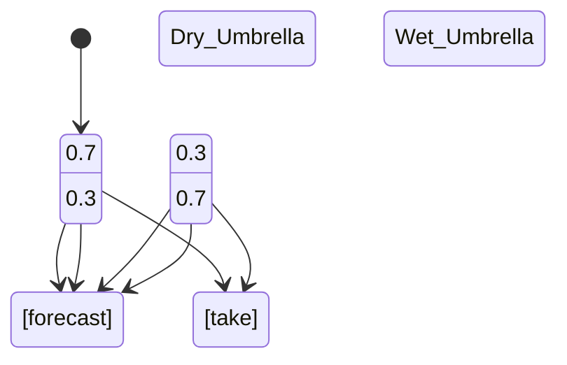

# PRISM 马尔可夫决策过程(MDP)

## 引言
马尔可夫决策过程（Markov Decision Process, MDP）是PRISM支持的**核心模型类型**之一，用于建模具有**非确定性选择**的概率系统。与离散时间马尔可夫链(DTMC)不同，MDP允许在状态转移中存在多个可能的动作（非确定性），每个动作对应不同的概率分布。这使得MDP特别适合描述**决策问题**，如机器人路径规划或资源调度。

:::note 关键特征
- **状态+动作**：每个状态下可选择不同动作
- **概率转移**：动作决定后续状态的概率分布
- **非确定性**：系统不预先指定动作选择策略
:::

## 基础语法结构
PRISM中MDP模型的基本框架如下：

```prism
mdp

module ModuleName
    // 状态变量声明
    x : [0..1] init 0;

    // 状态转移规则
    [action] guard -> p1:(x'=v1) + p2:(x'=v2);
endmodule
```

### 语法元素解析
1. `mdp`：声明模型类型
2. `[action]`：可选的动作标签（非确定性选择点）
3. `guard`：触发转移的条件
4. `p1:(x'=v1)`：概率p1下变量x变为v1

## 经典示例：天气预报决策
假设我们需要决定是否携带雨伞，天气预报的准确率为70%：

```prism
mdp

module Weather
    rain : bool init false;
    carry_umbrella : bool init false;

    // 自然行为（非可控）
    [forecast] !rain -> 0.7:(rain'=false) + 0.3:(rain'=true);
    [forecast] rain -> 0.7:(rain'=true) + 0.3:(rain'=false);

    // 决策行为
    [take] true -> (carry_umbrella'=true);
    [leave] true -> (carry_umbrella'=false);
endmodule

rewards "umbrella_cost"
    carry_umbrella : 1;
endrewards
```



## 模型分析要点
在PRISM中分析MDP时，通常需要：

1. **策略合成**：找出最优动作选择序列
   ```prism
   // 最小化长期淋雨概率
   Pmin=? [ F rain & !carry_umbrella ]
   ```

2. **多目标分析**：平衡不同奖励指标
   ```prism
   R{"umbrella_cost"}min=? [ F rain ]
   ```

## 实际应用案例
### 网络协议验证
验证无线网络MAC协议在冲突避免中的表现：

```prism
mdp
module Node
    backoff : [0..3] init 0;
    transmitting : bool init false;

    [wait] !transmitting -> (backoff'=max(backoff-1,0));
    [send] !transmitting & backoff=0 -> 0.9:(transmitting'=true) + 0.1:(backoff'=3);
    [timeout] transmitting -> (transmitting'=false);
endmodule
```

分析碰撞概率：
```prism
Pmax=? [ F<=10 transmitting ]
```

## 总结
MDP模型通过引入**非确定性选择**扩展了DTMC的表达能力，适用于：
- 需要建模决策过程的系统
- 存在多方交互的场景
- 需要优化策略的问题

:::tip 练习建议
1. 修改天气示例，增加"小雨"和"大雨"两种状态
2. 为网络协议示例添加能量消耗奖励结构
3. 尝试用`multi`组合多个目标函数
:::

## 扩展阅读
- PRISM官方文档：MDP模型规范
- 《Principles of Model Checking》第10章
- 经典论文：Markov Decision Processes in AI Planning