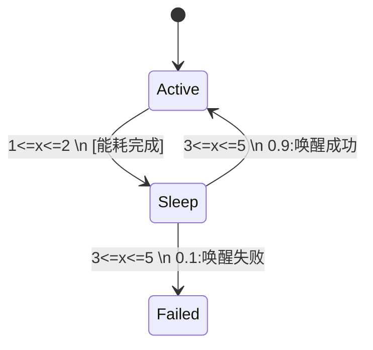

## 引言

概率时间自动机（Probabilistic Timed Automata, PTA）是PRISM模型检查器支持的一种高级模型类型，它结合了**时间约束**和**概率行为**，常用于实时系统的可靠性分析。PTA在传统时间自动机的基础上增加了概率分支，能够对带有时间延迟的随机决策系统（如通信协议、调度算法）进行精确建模。

## 核心概念

### 1. 时间自动机基础
PTA扩展自时间自动机(Timed Automata)，其核心组件包括：
- **时钟变量(Clocks)**：连续递增的变量，用于度量时间流逝
- **时钟约束(Guards)**：状态转移的时间条件（如 `x<=3`）
- **时钟重置(Resets)**：转移时重置某些时钟

### 2. 概率扩展
PTA在转移中添加了：
- **概率分支**：从一个状态到多个后继状态的转移概率分布
- **时间-概率交互**：时钟约束影响概率转移的触发时机

## 语法结构示例

以下是一个简单的PTA模型，模拟故障恢复系统：

```prism
pta

module RecoverySystem
    x : clock;  // 定义时钟变量
    status : [0..2] init 0;  // 0=正常, 1=故障, 2=恢复中

    // 正常状态下可能发生故障（概率0.1）或保持正常（概率0.9）
    [monitor] status=0 & x<=10 ->
        0.9 : (status'=0) & (x'=0) +
        0.1 : (status'=1) & (x'=0);

    // 故障后必须在2秒内启动恢复
    [repair] status=1 & x<=2 ->
        (status'=2) & (x'=0);

    // 恢复过程需要3-5秒
    [done] status=2 & x>=3 & x<=5 ->
        (status'=0) & (x'=0);
endmodule
```

:::note 关键元素说明
- `x : clock` 声明时钟变量
- `x<=10` 是时钟约束
- `0.9 : ... + 0.1 : ...` 表示概率分支
- `x'=0` 表示时钟重置
:::

## 实际应用案例

### 无线传感器网络
建模传感器节点的能耗行为：
1. **活跃模式**：持续1-2秒，能耗高
2. **休眠模式**：持续3-5秒，有10%概率唤醒失败



## 验证性质示例

在PRISM中可验证的PTA属性：
```prism
// 在100秒内系统保持正常的概率
P>=? [ F<=100 status=0 ]

// 最大恢复时间期望值
R{"time"}max=? [ F status=0 ]
```

输出示例：
```
Result: 0.982 (概率属性)
Result: 8.3 (时间期望值)
```

## 常见问题解决

:::caution 时钟爆炸问题
当模型复杂时，时钟约束组合可能导致状态空间爆炸：
- 解决方案：使用`clock(1..5)`声明有界时钟
- 优化技巧：合并相似的时间约束
:::

## 总结

PTA通过将时间约束与概率行为结合，为实时系统提供了强大的建模能力：
1. 使用时钟变量和约束表达时间依赖
2. 概率分支描述不确定行为
3. 适合建模故障恢复、超时机制等场景

## 扩展练习

1. 修改故障恢复案例，添加二级恢复机制（50%概率在1秒内完成）
2. 验证系统在1小时内进入故障状态的期望次数
3. 尝试用PTA建模交通信号灯的故障模式

## 进一步学习
- PRISM官方文档：PTA语法规范
- 《Principles of Model Checking》第28章
- UPPAAL-PRO工具对比学习