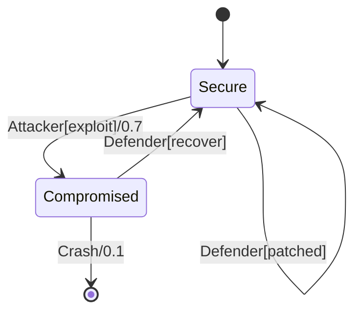

# PRISM 随机博弈(SMG)

## 简介

随机多人博弈(Stochastic Multiplayer Games, SMG)是PRISM模型检查器支持的一种交互式概率模型，用于描述多个决策者（玩家）在随机环境中的策略互动。与马尔可夫决策过程(MDP)不同，SMG允许两个或多个玩家以竞争或协作的方式影响系统行为。

:::note 核心特征
- **多玩家系统**：至少两个玩家各自拥有独立的策略空间
- **概率转移**：系统状态转移可能包含随机性
- **目标冲突**：玩家可能具有相互冲突的优化目标
:::

## 基础语法结构

PRISM中SMG模型使用`.smg`文件扩展名，其基本框架延续了`.pmd`(MDP)文件的语法，但需要明确指定玩家控制：

```prism
// 玩家定义
player P1
    [a1], [a2] // 玩家1的可控动作
endplayer

player P2
    [b1], [b2] // 玩家2的可控动作
endplayer

// 模型定义
smg

module Player1
    s : [0..1] init 0;
    
    [a1] s=0 -> 0.5:(s'=1) + 0.5:(s'=0); // 玩家1的动作a1
    [a2] s=0 -> (s'=1);                  // 玩家1的动作a2
endmodule

module Player2
    [b1] s=1 -> (s'=0); // 玩家2的动作b1
    [b2] s=1 -> 0.8:(s'=0) + 0.2:(s'=1); // 玩家2的动作b2
endmodule
```

## 关键组件详解

### 1. 玩家定义块

每个玩家通过`player...endplayer`块声明，包含该玩家可控的动作标签（用方括号标识）：

```prism
player NetworkAdmin
    [allow], [block], [scan]
endplayer
```

### 2. 模块中的玩家控制

在模块内部，动作前的标签表明哪个玩家控制该转移：

```prism
module SecuritySystem
    [admin_act] compromised=0 -> ... // 由admin_act对应的玩家控制
    [attacker] compromised=0 -> ... // 由attacker玩家控制
endmodule
```

### 3. 奖励结构

可以为不同玩家定义独立的奖励机制：

```prism
rewards "attacker_gain"
    [attack] success : 5;
endrewards

rewards "defender_cost"
    [defend] : -2;
endrewards
```

## 典型应用案例：网络安全博弈

考虑网络攻防场景，防御者(Defender)和攻击者(Attacker)在存在随机故障的网络中进行对抗：



对应的PRISM SMG模型：

```prism
player Defender
    [patched], [recover]
endplayer

player Attacker
    [exploit], [backdoor]
endplayer

smg

module Network
    state : [0..2] init 0; // 0=secure, 1=compromised, 2=crashed
    
    [exploit] state=0 -> 0.7:(state'=1) + 0.3:(state'=0);
    [patched] state=0 -> (state'=0);
    [backdoor] state=1 -> (state'=1);
    [recover] state=1 -> (state'=0);
    [] state=1 -> 0.1:(state'=2);
endmodule
```

## 模型分析方法

PRISM提供多种SMG分析技术：

1. **概率可达性**：
   ```prism
   Pmax=? [ F state=2 ] // 计算最坏情况下系统崩溃的概率
   ```

2. **多目标查询**：
   ```prism
   multi(P1[F win1], P2[F win2]) // 分析双方各自目标的帕累托前沿
   ```

3. **均衡分析**：
   ```prism
   // 计算纳什均衡策略
   strategy Nash = synthesis(..., "ne")
   ```

## 实际应用场景

1. **自动驾驶决策**：车辆与行人之间的交互博弈
2. **经济模型**：市场参与者间的策略互动
3. **网络安全**：攻击者与防御者的持续对抗
4. **生物系统**：物种间的进化竞争模型

## 总结

SMG模型为多智能体系统中的策略分析提供了形式化框架：

- 优势：能表达比MDP更复杂的交互关系
- 挑战：状态空间增长快，均衡计算复杂度高
- 典型工具链：PRISM-Games扩展提供了专用求解算法

## 延伸学习

推荐练习：
1. 将经典的囚徒困境模型转化为SMG形式
2. 在网络安全示例中添加随机故障转移
3. 分析不同策略组合下的奖励结构变化

进阶资源：
- PRISM官方文档Games部分
- 《Stochastic Games and Applications》学术专著
- 纳什均衡计算相关论文