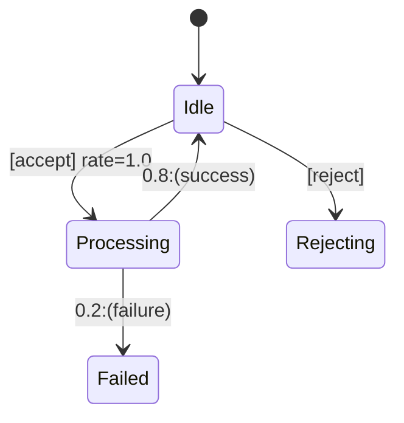

## 简介

马尔可夫自动机（Markov Automata, MA）是PRISM模型检测工具支持的**概率模型**之一，结合了连续时间马尔可夫链（CTMC）和马尔可夫决策过程（MDP）的特性。它允许对同时包含**概率性**和**非确定性**选择的系统进行建模，适用于分析实时系统的性能与可靠性。

:::note 关键特性
- **非确定性选择**：系统可能在不同动作间不确定地切换。
- **概率性延迟**：状态转移的时间延迟服从指数分布。
- 适用于协议验证、资源调度等场景。
:::

---

## 基本语法

PRISM中MA模型的语法与MDP类似，但增加了**速率**（rate）定义。以下是一个简单示例：

```prism
// 两状态马尔可夫自动机
ma

module Example
    s : [0..1] init 0; // 状态变量

    [act1] s=0 -> 0.5:(s'=1) + 0.5:(s'=0); // 非确定性动作
    [act2] s=0 -> 2.0:(s'=1); // 速率为2的指数分布延迟
    [] s=1 -> 1.0:(s'=0); // 无动作标签的瞬时转移
endmodule
```

**输出分析**：  
使用PRISM命令行验证属性：
```bash
prism model.prism -pf "P=? [ F s=1 ]"
```

---

## 核心概念详解

### 1. 状态与转移
MA的状态由**离散变量**定义，转移分为两类：
- **动作触发转移**（非确定性）：`[act] guard -> prob : update`
- **速率触发转移**（概率性）：`[] guard -> rate : update`

### 2. 并行组合
多个模块通过并行组合构成复杂系统：
```prism
// 第二个模块
module Process
    p : [0..1] init 0;
    [] p=0 -> 1.5:(p'=1);
    [] p=1 -> 0.5:(p'=0);
endmodule

// 组合模块
system "Example" || "Process" endsystem
```

---

## 实际案例：云服务器调度

假设一个云服务器需要决定是否接受任务（非确定性），任务处理时间服从指数分布：



对应的PRISM模型：
```prism
ma

module Server
    state : [0..2] init 0; // 0=Idle, 1=Processing, 2=Failed

    [accept] state=0 -> 1.0:(state'=1);
    [reject] state=0 -> (state'=0);
    [] state=1 -> 0.8:(state'=0) + 0.2:(state'=2);
endmodule
```

**分析属性**：  
```prism
// 计算任务失败概率
Pmax=? [ F state=2 ]
```

---

## 总结与练习

### 总结
- MA同时建模**非确定性选择**和**概率性延迟**。
- 适用于需要时间约束和决策分析的场景。
- 通过`[]`定义速率转移，`[label]`定义动作转移。

### 练习
1. 修改云服务器模型，增加一个`Maintenance`状态，速率为0.1。
2. 验证属性：“在100小时内达到Failed状态的最大概率”。

### 扩展阅读
- PRISM官方文档：[Markov Automata](https://www.prismmodelchecker.org/manual/ThePRISMLanguage/MarkovAutomata)
- 《Principles of Model Checking》第10章