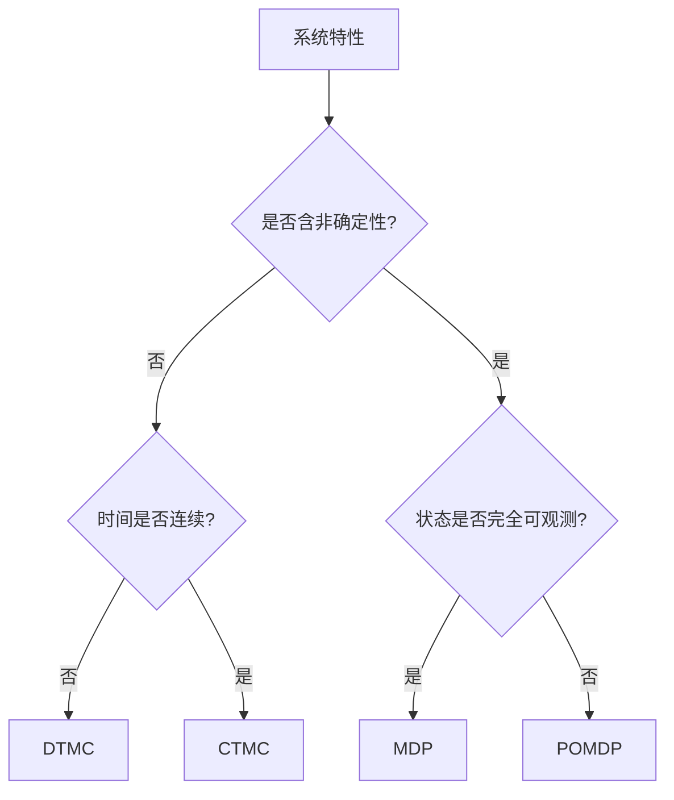

# PRISM 模型类型选择指南

## 引言

PRISM作为概率模型检测工具，支持四种核心模型类型：**离散时间马尔可夫链(DTMC)**、**连续时间马尔可夫链(CTMC)**、**马尔可夫决策过程(MDP)**和**部分可观测马尔可夫决策过程(POMDP)**。本指南将帮助初学者理解不同模型的适用场景，并通过实例演示选择方法。

## 模型类型概述



### 1. 离散时间马尔可夫链 (DTMC)
**适用场景**：离散时间步长的纯概率系统
- 无并发行为
- 状态转换仅由概率决定

```prism
// 简单的DTMC示例：硬币投掷
dtmc

module Coin
    state : [0..1] init 0; // 0=头, 1=尾
    [] state=0 -> 0.5 : (state'=0) + 0.5 : (state'=1);
    [] state=1 -> 0.5 : (state'=0) + 0.5 : (state'=1);
endmodule
```

:::note 典型应用
- 协议错误概率分析
- 算法随机性验证
:::

### 2. 连续时间马尔可夫链 (CTMC)
**适用场景**：时间连续且转移率可变的系统
- 使用指数分布模拟时间延迟
- 适合性能评估和实时系统

```prism
// 服务器请求处理的CTMC模型
ctmc

module Server
    idle -> busy : 2.0; // 每秒2个请求
    busy -> idle : 1.0; // 每秒处理1个请求
endmodule
```

### 3. 马尔可夫决策过程 (MDP)
**适用场景**：含非确定性选择的系统
- 多个可能的动作/策略
- 适用于控制器设计和规划问题

```prism
// 机器人导航MDP示例
mdp

module Robot
    x : [0..2] init 0;
    [move] x=0 -> 0.8:(x'=1) + 0.2:(x'=0);
    [move] x=1 -> 0.7:(x'=2) + 0.3:(x'=0);
    [stay] true -> (x'=x);
endmodule
```

:::tip 决策技巧
使用`<<...>>`运算符计算最优策略：
`<< "move" >> Pmax=? [ F x=2 ]`
:::

### 4. 部分可观测MDP (POMDP)
**适用场景**：状态信息不完全的系统
- 需要处理观测不确定性
- 常用于传感器网络和AI规划

```prism
// 简化POMDP示例（PRISM语法）
pomdp

observable
    obs1 = (x<2);
    obs2 = (x>=2);

module Main
    x : [0..3] init 0;
    [a1] x<3 -> 0.9:(x'=x+1) + 0.1:(x'=x);
    [a2] x>0 -> (x'=x-1);
endmodule
```

## 选择决策树

1. **确定系统特性**：
   - 是否有并发决策？ → 选择MDP/POMDP
   - 是否是纯概率系统？ → 选择DTMC/CTMC

2. **时间特性**：
   - 离散时间步骤 → DTMC
   - 连续时间间隔 → CTMC

3. **可观测性**：
   - 完全可观测 → MDP
   - 部分可观测 → POMDP

## 实际案例对比

| 场景                | 推荐模型 | 原因                          |
|---------------------|----------|-------------------------------|
| 网络协议可靠性      | DTMC     | 离散时间步长，无并发控制      |
| 云计算资源分配      | MDP      | 需要优化决策策略              |
| 化学反应模拟        | CTMC     | 连续时间，速率依赖温度        |
| 自动驾驶感知系统    | POMDP    | 传感器数据存在不确定性        |

## 常见错误规避

:::caution 注意事项
1. CTMC中转移率单位必须一致（如全用秒⁻¹）
2. MDP中需明确定义所有可能的动作
3. POMDP模型复杂度随观测变量指数增长
:::

## 总结与练习

### 关键要点
- DTMC：最简单的概率系统建模
- CTMC：需要模拟实际时间延迟的场景
- MDP：存在控制决策的优化问题
- POMDP：处理不完全观测的复杂系统

### 巩固练习
1. 将以下场景转换为PRISM模型类型：
   - 智能家居照明控制系统（考虑传感器误差）
   - 二进制指数退避协议

2. 比较相同系统的DTMC和CTMC建模差异

### 扩展资源
- PRISM官方文档：Model Types章节
- 《Principles of Model Checking》第10章
- COURSEA课程：Probabilistic Graphical Models