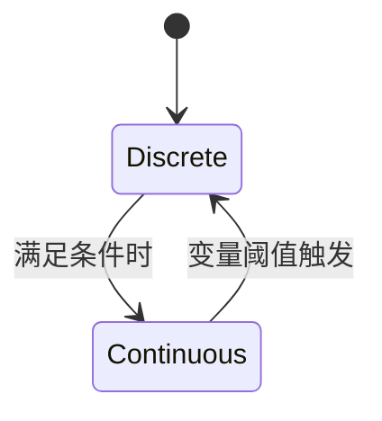

# PRISM 混合模型策略

## 介绍
PRISM中的**混合模型策略**允许用户同时建模离散事件和连续行为，适用于需要分析既有瞬时变化又有持续动态的复杂系统。这类模型结合了马尔可夫决策过程（MDP）和连续时间马尔可夫链（CTMC）的特性，常用于网络协议、混合控制系统等场景。

:::note 关键概念
- **离散部分**：由状态转换和即时动作控制（如MDP）
- **连续部分**：随时间连续变化的变量（如CTMC中的速率）
:::

## 模型定义语法
混合模型在PRISM中通过 `.pm` 文件定义，语法示例如下：

```prism
// 定义连续变量
continuous x in [0, 10] init 0;

// 离散模块
module DiscreteModule
    state: [0..1] init 0;
    [action] state=0 -> 0.8:(state'=1) + 0.2:(state'=0);
endmodule

// 连续动态
module ContinuousModule
    [continuous] x <= 5 -> x' = x + 1;
    [continuous] x > 5  -> x' = x - 0.5;
endmodule
```

## 工作原理
1. **离散转换**：通过`action`标签触发瞬时状态变化
2. **连续演化**：通过`continuous`标签描述变量随时间的变化率
3. **交互机制**：离散事件可重置连续变量，连续条件可触发离散动作



## 实际案例：温度控制系统
假设一个智能温控系统需要：
- 离散模式：开关机状态
- 连续行为：温度变化动态

```prism
// 温度连续变量（单位：℃）
continuous temp in [10,40] init 20;

module Controller
    mode: [off, on] init off;
    [switch_on] mode=off -> (mode'=on);
    [switch_off] mode=on & temp>=22 -> (mode'=off);
endmodule

module Environment
    [continuous] mode=on  -> temp' = temp - 0.1*temp + 5;
    [continuous] mode=off -> temp' = temp - 0.2*(temp-15);
endmodule
```

:::tip 实验建议
尝试添加属性验证：
```
P=? [ F temp>=30 ]
```
计算温度超过30℃的概率
:::

## 常见问题
1. **变量同步**：确保离散动作和连续更新不会导致矛盾
2. **时间尺度**：合理设置连续变量的变化速率单位
3. **模型检查限制**：某些复杂混合系统可能需要近似分析

## 总结
混合模型策略扩展了PRISM对现实系统的建模能力，特别适合：
- 嵌入式系统
- 物理-数字交互系统
- 具有多时间尺度的过程

**延伸学习**：
1. PRISM官方文档中的[混合系统案例库](https://www.prismmodelchecker.org/)
2. 尝试修改温控案例，增加多个离散控制模式
3. 研究`simulate`命令的混合模型仿真输出