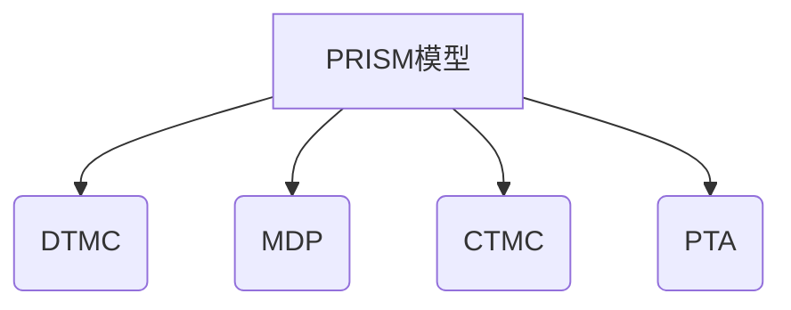

# PRISM 模型类型约束

## 介绍

在PRISM概率模型检测器中，模型类型约束定义了不同建模范式（如离散时间马尔可夫链DTMC、连续时间马尔可夫链CTMC等）的行为规则和限制条件。理解这些约束对于正确构建模型和解释分析结果至关重要。本节将详细介绍PRISM支持的四种主要模型类型的约束条件。

## 模型类型概述

PRISM支持以下四种核心模型类型：

1. **离散时间马尔可夫链 (DTMC)**
2. **马尔可夫决策过程 (MDP)**
3. **连续时间马尔可夫链 (CTMC)**
4. **概率定时自动机 (PTA)**



## 各模型类型约束详解

### 1. 离散时间马尔可夫链 (DTMC)

**核心约束**：
- 完全概率性：每个状态的所有 outgoing transitions 概率之和必须等于1
- 无非确定性选择
- 时间步长为离散单位

**示例模型**：
```prism
dtmc

module Die
    state : [0..3] init 0;
    [] state=0 -> 0.5:(state'=1) + 0.5:(state'=2);
    [] state=1 -> 0.5:(state'=3) + 0.5:(state'=0);
    [] state=2 -> 0.5:(state'=3) + 0.5:(state'=0);
    [] state=3 -> 1.0:(state'=3);
endmodule
```

:::note 验证要点
在DTMC中，PRISM会检查每个状态的转移概率总和是否为1。如果不符合，会报错：
`Error: Probabilities in module "Die" do not sum to 1`
:::

### 2. 马尔可夫决策过程 (MDP)

**核心约束**：
- 允许非确定性选择（多个动作选项）
- 每个动作选项内部必须满足概率分布约束（总和=1）
- 时间步长仍为离散单位

**示例模型**：
```prism
mdp

module Process
    state : [0..2] init 0;
    [start] state=0 -> 0.8:(state'=1) + 0.2:(state'=2);
    [retry] state=0 -> 1.0:(state'=0);
    [done] state=1 -> 1.0:(state'=2);
endmodule
```

:::tip 实际应用
MDP常用于建模具有多种策略选择的系统，如：
- 网络协议的重传机制
- 资源调度算法
- 机器人路径规划
:::

### 3. 连续时间马尔可夫链 (CTMC)

**核心约束**：
- 使用转移速率(rate)而非概率
- 无明确时间步长概念
- 状态停留时间服从指数分布

**示例模型**：
```prism
ctmc

module Queue
    jobs : [0..2] init 0;
    [] jobs=0 -> 2.0:(jobs'=1);
    [] jobs=1 -> 1.5:(jobs'=2) + 0.5:(jobs'=0);
    [] jobs=2 -> 1.0:(jobs'=1);
endmodule
```

:::caution 重要区别
CTMC中的速率值可以大于1，这与DTMC/MDP的概率值（必须≤1）有本质区别
:::

### 4. 概率定时自动机 (PTA)

**核心约束**：
- 结合了时钟变量和概率选择
- 时钟约束使用`x<=5`等形式
- 允许时钟重置

**示例模型片段**：
```prism
pta

module Sensor
    x : clock;
    state : [0..1] init 0;
    [send] state=0 & x<=2 -> 0.9:(state'=1) + 0.1:(state'=0 & x'=0);
    [timeout] state=0 & x>=2 -> 1.0:(state'=0 & x'=0);
endmodule
```

## 模型约束验证案例

### 案例：网络协议重传机制

考虑一个使用MDP建模的简单重传协议：

```prism
mdp

module Protocol
    s : [0..2] init 0; // 0=ready, 1=wait, 2=done
    [send] s=0 -> 0.9:(s'=2) + 0.1:(s'=1);
    [wait] s=1 -> 0.7:(s'=0) + 0.3:(s'=2);
    [timeout] s=1 -> 1.0:(s'=0);
endmodule
```

**约束分析**：
1. 状态`s=0`有1个动作选项(`send`)
2. 状态`s=1`有2个动作选项(`wait`和`timeout`)，体现非确定性
3. 每个动作内部概率总和为1

## 常见约束错误及解决

1. **概率总和不为1**：
   ```
   Error: Probabilities do not sum to 1
   ```
   解决方案：检查所有转移的概率和，必要时添加默认转移

2. **无效的模型类型操作**：
   ```
   Error: Cannot use non-determinism in DTMC
   ```
   解决方案：将模型类型改为MDP或检查命令语法

3. **CTMC速率值为负**：
   ```
   Error: Negative rate value
   ```
   解决方案：确保所有速率≥0

## 总结

PRISM的不同模型类型约束反映了各自的理论基础和应用场景：

| 模型类型 | 核心约束 | 适用场景 |
|----------|----------|----------|
| DTMC | 严格概率性 | 完全随机系统 |
| MDP | 动作选项间非确定性 | 决策系统 |
| CTMC | 转移速率 | 连续时间系统 |
| PTA | 时钟约束 | 实时系统 |

## 延伸学习

1. **推荐练习**：
   - 将一个DTMC模型转换为MDP，添加决策点
   - 在CTMC模型中计算状态的平均停留时间
   - 为PTA模型添加时钟约束条件

2. **进阶概念**：
   - 模型类型间的转换关系
   - 混合自动机(Hybrid Automata)
   - 部分可观察MDPs(POMDPs)

通过理解这些模型约束，你将能够更准确地构建PRISM模型并获得有意义的验证结果。