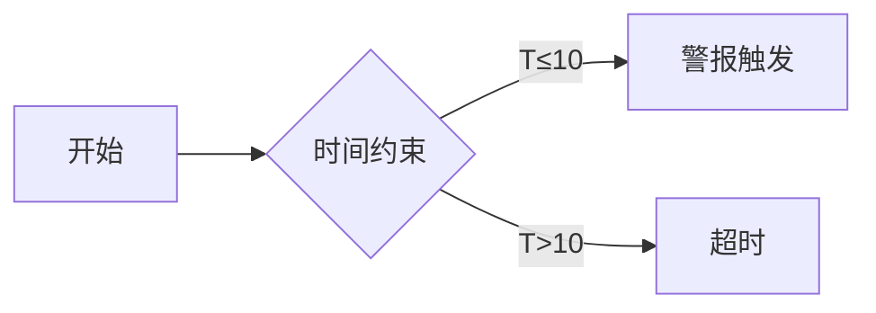

# PRISM 属性规范语言

## 介绍

PRISM属性规范语言是概率模型检测工具PRISM中用于定义系统行为属性的专用语言。它基于**概率计算树逻辑（PCTL）**和**连续随机逻辑（CSL）**的扩展，允许用户形式化地描述系统在不同状态下的概率、期望值和时间相关特性。

:::tip 为什么需要属性规范？
模型检测的核心是验证系统是否满足特定属性。PRISM属性语言提供了精确的数学表达方式，例如：
- "系统在99%的情况下不会死锁"
- "平均能耗不超过5焦耳"
:::

## 基础语法结构

PRISM属性由以下核心元素构成：

```prism
P=? [ F "success" ]  // 最终达到"success"状态的概率
S=? [ "queue_full" ] // 稳态下队列满的概率
```

### 1. 概率运算符 (`P`)

用于查询路径属性成立的概率：

```prism
P>=0.99 [ G !"failure" ]  // 系统始终不失败的概率≥99%
```

### 2. 稳态运算符 (`S`)

描述系统长期运行后的稳态行为：

```prism
S<0.01 [ "buffer_overflow" ] // 稳态时缓冲区溢出概率<1%
```

### 3. 期望值运算符 (`R`)

计算奖励（或代价）的期望值：

```prism
R{"energy"}=? [ F "done" ] // 完成任务前的平均能耗
```

## 时间相关属性

PRISM支持时间界限规范（时间单位为模型的时间单位）：

```prism
P>=0.95 [ F<=10 "alarm" ]  // 10秒内触发警报的概率≥95%
```



## 实际案例

### 案例1：通信协议
验证消息在3次重传内成功传递的概率：

```prism
P=? [ F<=3 "delivered" ] 
```

### 案例2：云服务SLA
保证服务可用性不低于99.9%：

```prism
S>=0.999 [ "available" ]
```

## 高级特性

### 过滤器语法
只针对特定状态计算属性：

```prism
P=? [ F s=7 | s0=3 ]  // 初始状态为3时最终到达7的概率
```

### 多目标属性
组合多个条件：

```prism
P=? [ !"error" U "complete" ]  // 在完成前不出现错误的概率
```

## 常见错误与调试

:::caution 易错点
1. 错误使用引号：`"state"`是原子命题，`state`是变量
2. 时间单位混淆：确保时间界限与模型定义一致
3. 运算符优先级：`U`(until)的优先级低于逻辑运算符
:::

## 总结

PRISM属性规范语言的关键要素：

| 元素 | 示例 | 用途 |
|------|------|------|
| `P`  | `P>=0.9 [ F x>5 ]` | 概率验证 |
| `S`  | `S<0.01 [ "fail" ]` | 稳态分析 |
| `R`  | `R{"cost"}=? [ C ]` | 资源消耗分析 |

## 延伸练习

1. 为交通信号灯模型编写属性："红灯持续时间不超过30秒的概率"
2. 尝试用奖励机制表达"系统平均响应时间"

## 附加资源

- PRISM官方文档：Property Specification章节
- 《Principles of Model Checking》第10章
- PCTL/CSL逻辑规范标准