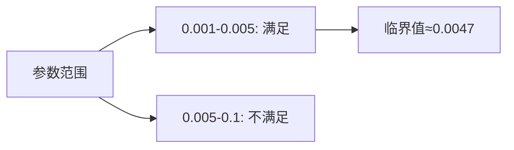

# PRISM 参数合成

## 介绍

参数合成（Parameter Synthesis）是PRISM工具的核心功能之一，它允许我们自动寻找满足特定概率或时序性质的系统参数值。与传统的模型检查不同，参数合成不需要预先固定所有参数值，而是将参数作为变量处理，通过数学方法推导出满足约束的参数范围。

:::tip 为什么需要参数合成？
在系统设计中，我们常常需要回答类似"故障率低于多少时系统可靠性超过99%？"的问题。手动反复调整参数进行验证效率低下，而参数合成能自动化这一过程。
:::

## 基本语法

PRISM中参数合成通过`param`关键字声明可变参数，并在属性规范中使用这些参数。基本结构如下：

```prism
// 定义参数
param double x in [0.1, 0.9];

// 模型中使用参数
module Example
  s : [0..1] init 0;
  [] s=0 -> x : (s'=1) + (1-x) : (s'=0);
endmodule

// 属性查询
P=? [ F s=1 ]
```

## 参数合成类型

PRISM支持三种主要参数合成方法：

1. **精确合成**：计算参数满足性质的确切范围
   ```prism
   param double p in [0,1];
   P>0.5 [ F "success" ]
   ```

2. **近似合成**：通过采样和插值近似参数范围
   ```prism
   param int N in {1..10};
   P>=0.9 [ F<=100 "complete" ]
   ```

3. **优化合成**：寻找最优参数值
   ```prism
   param double rate in [0.1,5.0];
   filter(max, P=? [ F "done" ], rate)
   ```

## 实际案例：云服务可靠性

考虑一个云服务系统，我们需要确定服务器故障率的最大可接受值，使得系统整体可用性不低于99.9%：

```prism
// 定义故障率参数
param double failure_rate in [0.001, 0.1];

// 云服务模型
module CloudService
  state : [0..2] init 0; // 0=运行, 1=故障, 2=恢复
  [] state=0 -> failure_rate : (state'=1) + (1-failure_rate) : (state'=0);
  [] state=1 -> 0.5 : (state'=2); // 恢复过程
  [] state=2 -> 1.0 : (state'=0);
endmodule

// 稳态可用性分析
S>=0.999 [ state=0 | state=2 ]
```

PRISM会计算`failure_rate`的临界值，当超过该值时系统将无法满足99.9%的可用性要求。

## 可视化结果分析

PRISM可以生成参数-概率的关系曲线。例如对于上述云服务案例，结果可能显示：



## 高级技巧

1. **多参数合成**：可以同时合成多个参数
   ```prism
   param double p1 in [0,1];
   param double p2 in [0,1];
   P>0.8 [ F "goal" ]
   ```

2. **参数约束**：添加参数间的约束关系
   ```prism
   param double p in [0,1];
   param double q in [0,1];
   const p + q <= 1;
   ```

3. **分段合成**：对不同参数区域采用不同策略
   ```prism
   strategy = if (p<0.5) then "quick" else "accurate";
   ```

## 常见问题

:::caution 参数合成限制
- 非线性参数依赖可能导致合成失败
- 高维参数空间会显著增加计算复杂度
- 离散和连续参数的混合需要特殊处理
:::

## 总结

PRISM的参数合成功能为系统设计提供了强大的分析手段，能够：
- 自动确定满足性质的参数边界
- 可视化参数与性质的关系
- 支持多种参数类型和约束条件

## 延伸学习

1. 尝试修改云服务案例，增加备用服务器模块并合成其激活阈值
2. 研究PRISM手册中`filter`函数的各种用法
3. 探索如何将合成结果导出为MATLAB/Octave可处理的格式

:::note 练习
为以下交通灯控制系统合成绿灯时长参数，要求车辆平均等待时间不超过30秒：
```prism
param int green_time in [10,60]; // 绿灯时长(秒)
module TrafficLight
  light : [0..1]; // 0=红, 1=绿
  [switch] true -> (green_time/60) : (light'=1) + ((60-green_time)/60) : (light'=0);
endmodule
reward "waiting"
  [switch] light=0 : 1;
endreward
R{"waiting"}<=30 [ C ]
```
:::