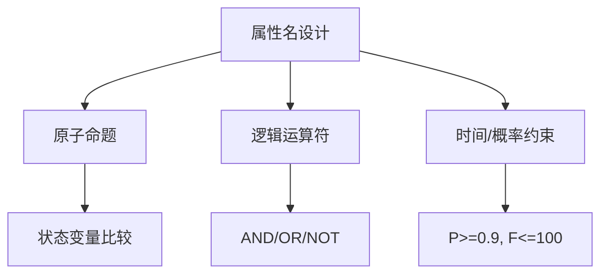

# PRISM 属性命名

## 介绍

在PRISM概率模型检查器中，**属性命名**是为模型验证时定义的逻辑属性指定标识符的过程。良好的属性命名能显著提升模型的可读性和维护性。本指南将详细介绍PRISM属性命名的语法规则、最佳实践以及常见应用场景。

---

## 基本语法规则

PRISM属性命名的核心规则如下：

1. **必须以字母开头**：属性名不能以数字或符号开头。
2. **仅允许特定字符**：可使用字母（A-Z, a-z）、数字（0-9）和下划线（_）。
3. **区分大小写**：`TimeLimit` 和 `timelimit` 被视为不同属性。
4. **避免保留字**：如 `true`, `false`, `min`, `max` 等PRISM关键字。

### 示例：有效与无效命名
```prism
// 有效命名
const int MAX_RETRIES = 3;
formula success = (state=1);

// 无效命名（将引发语法错误）
const int 2attempts = 2;      // 数字开头
formula $value = (x>0);       // 非法符号
```

:::tip 命名建议
- 使用驼峰式（`serverResponseTime`）或蛇形命名法（`server_response_time`）
- 通过前缀表明属性类型，如 `prob_` 表示概率属性
:::

---

## 复合属性命名

当属性由多个逻辑部分组成时，可通过运算符组合：

```prism
// 组合离散时间与连续时间属性
formula system_stable = (queue_size=0) & (power_mode="normal");

// 带概率阈值的命名示例
P>=0.95 [ F<=300 "alarm_triggered" ]
```



---

## 实际应用案例

### 案例1：通信协议重传机制
```prism
// 定义最大重试次数属性
const int MAX_RETRY = 5;

// 命名"成功传输概率"属性
formula transmission_success = (retries <= MAX_RETRY) & (ack_received=true);

// 验证属性
P>=0.99 [ F transmission_success ]
```

### 案例2：温度控制系统
```prism
// 命名"危险高温"属性
formula critical_temp = (sensor1_temp > 100) | (sensor2_temp > 100);

// 验证系统在10分钟内进入危险状态的概率
P<=0.01 [ F<=600 critical_temp ]
```

:::warning 常见错误
1. 在属性名中使用连字符：`formula temp-state`（应改为 `temp_state`）<br />
2. 混淆大小写：`formula Critical` 和 `formula critical` 是两个不同属性
:::

---

## 总结

- PRISM属性命名需遵循**字母开头**、**有限字符集**的基本规则
- 复合属性应清晰反映其逻辑组成
- 实际建模中建议采用**一致性命名规范**

## 扩展练习

1. 为交通信号灯模型设计三个属性，分别表示：
   - 红灯持续时间不超过60秒的概率
   - 两盏灯同时亮起的可能性
   - 系统响应紧急事件的延迟阈值

2. 修复以下错误命名：
   ```prism
   formula 1st_try = (attempt=1);
   const double @rate = 0.5;
   ```

## 延伸阅读
- PRISM官方文档《Property Specification》
- 《Principles of Model Checking》第10章