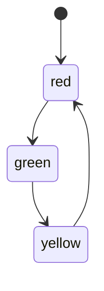

# PRISM 状态公式

## 介绍

PRISM（Probabilistic Symbolic Model Checker）是一个用于建模和分析概率系统的工具。在PRISM中，**状态公式（State Formulas）**用于描述系统在特定状态下满足的逻辑条件。它们是PRISM属性规范的核心组成部分，常用于定义系统应满足的临时性（temporal）或概率性（probabilistic）属性。

状态公式可以包含布尔表达式、算术比较、概率运算符等，允许用户精确描述系统行为的约束条件。理解状态公式是使用PRISM进行模型验证的基础。

## 基本语法

PRISM状态公式的基本语法包括以下元素：

1. **布尔常量**：`true`、`false`。
2. **逻辑运算符**：`&`（与）、`|`（或）、`!`（非）。
3. **算术比较**：`<`、`<=`、`>`、`>=`、`=`、`!=`。
4. **变量引用**：直接使用模型中的变量名（如 `x`、`y`）。
5. **括号**：用于明确运算优先级。

### 示例：简单状态公式

以下是一个简单的状态公式示例，检查变量 `x` 是否大于 5 且 `y` 等于 10：

```prism
(x > 5) & (y = 10)
```

## 状态公式的组成

### 1. 原子命题
原子命题是状态公式的最小单位，通常是变量与常量或变量的比较。例如：
- `x = 0`：检查变量 `x` 是否为 0。
- `queue_size <= 10`：检查队列大小是否不超过 10。

### 2. 逻辑组合
通过逻辑运算符将原子命题组合成更复杂的公式。例如：
- `(x > 0) & (y < 100)`：`x` 大于 0 **且** `y` 小于 100。
- `(status = "idle") | (status = "ready")`：状态为 "idle" **或** "ready"。

### 3. 嵌套公式
状态公式可以嵌套，以表达更复杂的逻辑。例如：
```prism
((x > 0) & (y < 100)) | (z = "error")
```

## 实际案例

### 案例1：交通灯系统
假设我们有一个交通灯模型，状态变量 `light` 可以是 "red"、"yellow" 或 "green"。以下状态公式检查交通灯是否为红色或黄色：

```prism
(light = "red") | (light = "yellow")
```

### 案例2：队列模型
在一个队列系统中，变量 `queue_size` 表示当前队列长度，`max_size` 是队列的最大容量。以下状态公式检查队列是否已满：

```prism
queue_size = max_size
```

## 高级用法

### 概率运算符
PRISM允许在状态公式中使用概率运算符（如 `P`、`S`），但通常这些运算符用于更高级的**路径公式**。状态公式通常用于描述瞬时条件。

### 时态逻辑结合
状态公式可以与时态逻辑运算符（如 `F`、`G`、`U`）结合，形成更复杂的属性。例如：
```prism
P>=0.9 [ F (x > 10) ]
```
表示“系统以至少 90% 的概率最终达到 `x > 10` 的状态”。

## 可视化状态转换

以下是一个简单的状态转换图，展示交通灯系统的状态变化：



## 总结

PRISM状态公式是描述系统状态逻辑条件的基础工具。通过布尔表达式、算术比较和逻辑运算符，可以定义从简单到复杂的系统属性。掌握状态公式是进一步学习PRISM路径公式和概率验证的关键。

## 附加资源与练习

### 练习
1. 编写一个状态公式，检查变量 `temperature` 是否在 20 到 30 之间。
2. 在一个有三个状态的系统（"start"、"running"、"done"）中，编写一个公式检查系统是否处于 "running" 或 "done" 状态。

### 进一步学习
- 阅读PRISM官方文档中的[属性规范章节](http://www.prismmodelchecker.org/manual/PropertySpecification)。
- 尝试在PRISM GUI中加载示例模型并验证自定义状态公式。