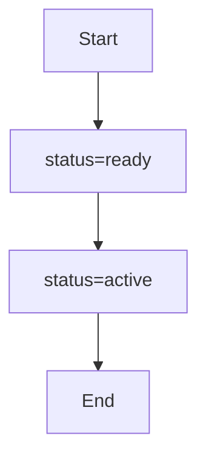

# PRISM 路径公式

## 简介

在PRISM概率模型检测器中，**路径公式（Path Formulas）**用于描述系统执行路径上的时序行为。它们是属性规范的核心组成部分，与状态公式结合使用，可以表达复杂的概率性质（如“系统最终以至少90%的概率达到目标状态”）。路径公式基于**线性时序逻辑（LTL）**和**概率计算树逻辑（PCTL）**的扩展，支持对随机系统的定量分析。

## 基本语法

PRISM路径公式的语法由以下基本运算符构成：

| 运算符 | 含义               | 示例                     |
|--------|--------------------|--------------------------|
| `X`    | 下一个状态（Next） | `X x>0`                  |
| `U`    | 直到（Until）      | `x<5 U x=0`              |
| `F`    | 最终（Finally）    | `F x=1`（等价于`true U x=1`） |
| `G`    | 全局（Globally）   | `G x!=0`（等价于`¬F x=0`）   |

:::tip
路径公式通常与**概率运算符** `P` 结合使用，例如 `P>=0.9 [F success]` 表示“最终达到success状态的概率至少为90%”。
:::

## 运算符详解

### 1. Next (`X`)
描述**下一个状态**满足的条件。例如：
```prism
P=? [ X x=1 ]
```
计算系统下一步中 `x=1` 的概率。

### 2. Until (`U`)
`φ1 U φ2` 表示“φ1一直为真，直到φ2为真”。例如：
```prism
P>0.5 [ x<5 U x=0 ]
```
验证“x在小于5的情况下持续，直到x=0”的概率是否超过50%。

### 3. Finally (`F`)
`F φ` 表示“最终会满足φ”。常用于表达“系统最终达到某个目标状态”：
```prism
P>=0.9 [ F temperature > 100 ]
```
验证温度最终超过100的概率是否≥90%。

### 4. Globally (`G`)
`G φ` 表示“始终满足φ”。例如：
```prism
P=? [ G !error ]
```
计算系统永不触发error的概率。

## 实际案例

### 案例1：通信协议
验证“消息在10步内成功传递的概率”：
```prism
P=? [ F<=10 delivered ]
```

### 案例2：机器人导航
验证“机器人在碰撞前找到出口的概率”：
```prism
P=? [ !collision U exit ]
```

## 组合使用

路径公式可与逻辑运算符组合，表达复杂性质。例如：
```prism
P=? [ F (status=ready & X status=active) ]
```
计算“最终进入ready状态且下一步变为active”的概率。



## 总结

- 路径公式描述系统执行路径上的时序行为。
- 核心运算符包括 `X`、`U`、`F`、`G`，可组合使用。
- 实际应用涵盖协议验证、机器人规划等场景。

## 练习
1. 编写一个路径公式，验证“系统在5步内不重启的概率”。
2. 修改案例2的公式，要求机器人在10步内到达出口且不碰撞。

## 扩展阅读
- PRISM官方文档：[Path Formulas](https://www.prismmodelchecker.org/manual/PropertySpecification/PathFormulas)
- 《Principles of Model Checking》第10章（MIT Press）