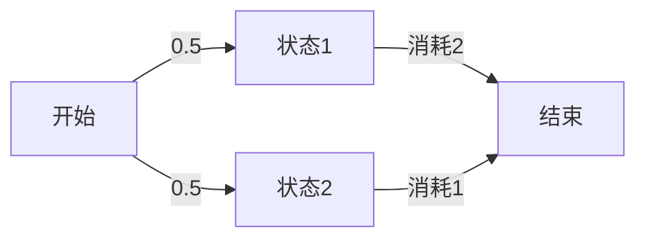

# PRISM 奖励属性

## 介绍

在概率模型检查中，**奖励属性**（Reward Properties）是PRISM工具的核心功能之一，用于量化系统行为的"成本"或"收益"。与常规属性（如"系统最终会达到目标状态"）不同，奖励属性允许我们回答诸如："完成任务的平均能耗是多少？"或"系统在崩溃前平均能运行多久？"等问题。

奖励属性通过为模型中的状态和/或转换分配数值（称为"奖励"）来实现这种量化分析。PRISM支持四种基本奖励属性类型：

1. **瞬时奖励**（Instantaneous reward）：某时刻的预期奖励值
2. **累积奖励**（Cumulative reward）：到某时刻为止的累计奖励总和
3. **基于状态的奖励**（State rewards）：当系统处于某状态时获得的奖励
4. **基于转换的奖励**（Transition rewards）：当系统执行某转换时获得的奖励

## 奖励结构定义

在PRISM模型中，奖励通过`rewards`和`endrewards`块定义：

```prism
rewards "energy_consumption"
    [action1] state1=1 : 0.5; // 转换奖励
    state2=1 : 1.2;          // 状态奖励
endrewards
```

## 奖励属性语法

PRISM使用PCTL（概率计算树逻辑）的扩展语法来指定奖励属性：

| 属性类型       | 语法格式                     | 描述                          |
|----------------|-----------------------------|-----------------------------|
| 瞬时奖励       | `R{"reward_name"}=? [ I=k ]` | 在k时刻的预期奖励值           |
| 累积奖励       | `R{"reward_name"}=? [ C<=k ]` | 前k个时间步的累积奖励         |
| 到达状态奖励   | `R{"reward_name"}=? [ F phi ]` | 直到满足条件phi的累积奖励     |
| 长期平均奖励   | `R{"reward_name"}=? [ S ]`    | 长期运行的平均奖励率          |

## 实际案例

### 案例1：能耗分析

考虑一个传感器网络模型，我们想计算系统在10个时间单位内的平均能耗：

```prism
// 模型定义
dtmc

rewards "energy"
    [sense] true : 0.3;  // 每次传感消耗0.3单位能量
    [sleep] true : 0.1;  // 睡眠模式消耗0.1单位能量
endrewards

// 查询
R{"energy"}=? [ C<=10 ]  // 前10个时间单位的累积能耗
```

### 案例2：系统可靠性

分析服务器系统在崩溃前的平均运行时间：

```prism
// 模型定义
ctmc

rewards "uptime"
    // 每个状态每秒获得1单位奖励（代表运行时间）
    !failed : 1;
endrewards

// 查询
R{"uptime"}=? [ F failed ]  // 直到系统崩溃的累积运行时间
```

## 高级用法

### 多目标优化

PRISM允许组合多个奖励属性进行多目标分析。例如同时考虑能耗和服务质量：

```prism
rewards "energy"
    [process] true : 1.5;
endrewards

rewards "quality"
    queue_length > 5 : -0.2; // 队列过长时服务质量下降
endrewards

// 查询Pareto最优曲线
multi(R{"energy"}<=E [ C<=T ], R{"quality"}>=Q [ C<=T ])
```

### 条件奖励



对应的PRISM查询：
```prism
R{"cost"}=? [ F done | !failed U done ] // 在成功完成条件下的累积成本
```

## 常见错误与调试

:::caution 常见问题
1. **未命名的奖励结构**：每个奖励块必须有唯一标识字符串
2. **混合状态/转换奖励**：确保清楚每种奖励的应用场景
3. **时间单位不匹配**：在CTMC中注意时间单位与奖励率的协调
4. **无限累积奖励**：确保累积奖励查询有明确终止条件
:::

## 总结

PRISM的奖励属性为概率系统分析提供了强大的量化工具，能够：
- 评估系统性能指标（吞吐量、响应时间）
- 计算资源消耗（能耗、内存使用）
- 分析可靠性指标（平均无故障时间）
- 支持多目标优化决策

## 扩展练习

1. 修改传感器案例，添加电池充电状态，并计算系统寿命周期
2. 创建一个队列模型，比较不同调度策略的累积等待时间
3. 尝试组合瞬时奖励和累积奖励进行复合查询

## 延伸阅读

- PRISM手册第10章：Reward-based Properties
- 《Principles of Model Checking》第10.5节
- 案例研究：无线网络协议的能量效率分析