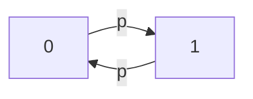

# PRISM 稳态属性

## 介绍

稳态属性（Steady-state Properties）是PRISM模型检查器中用于描述系统**长期运行后**行为特性的重要工具。它们回答诸如"系统在无限时间后处于某个状态的概率是多少？"或"长期平均奖励值是多少？"等问题。这类属性对于分析系统的稳定性、可靠性和性能至关重要。

在概率模型检查中，稳态属性通常表示为 `S` 运算符，其语法为：
```prism
S [ property ]
```
其中 `property` 可以是状态条件（如 `x>0`）或奖励结构相关的表达式。

## 稳态概率基础

### 数学概念
稳态概率表示马尔可夫过程在无限时间后达到平衡状态时的概率分布。对于离散时间马尔可夫链（DTMC），这满足方程：
```
π = π * P
```
其中π是稳态概率向量，P是转移概率矩阵。

### PRISM 语法示例
计算系统处于"success"状态的长期概率：
```prism
S=? [ "success" ]
```

## 实际案例解析

### 案例1：简单DTMC模型
考虑一个具有两个状态（0和1）的DTMC，以概率p在状态间切换：



对应的PRISM模型：
```prism
dtmc

module TwoStates
    s : [0..1] init 0;
    
    [] s=0 -> p : (s'=1) + (1-p) : (s'=0);
    [] s=1 -> p : (s'=0) + (1-p) : (s'=1);
endmodule
```

稳态属性查询：
```prism
// 处于状态0的长期概率
S=? [ s=0 ]

// 处于状态1的长期概率
S=? [ s=1 ]
```

:::note
对于这个对称模型，当p=0.5时，两个状态的稳态概率都将是0.5
:::

### 案例2：带有奖励的CTMC
分析一个服务器系统的长期平均利用率：

```prism
ctmc

const double lambda = 0.1; // 故障率
const double mu = 1.0;    // 修复率

module Server
    status : [0..1]; // 0=down, 1=up
    
    [] status=0 -> mu : (status'=1);
    [] status=1 -> lambda : (status'=0);
endmodule

rewards "uptime"
    status=1 : 1;
endrewards
```

查询长期平均运行时间比例：
```prism
S=? [ status=1 ]
```

查询长期平均奖励（等同于运行时间比例）：
```prism
S=? [ "uptime" ]
```

## 高级应用

### 条件稳态概率
可以结合过滤器计算特定条件下的稳态概率。例如，在队列模型中计算非空队列的稳态概率：

```prism
filter(state, S=? [ q>0 ], q=0)
```

### 与时间平均奖励的关系
对于连续时间模型，稳态奖励等同于无限时间 horizon 的时间平均奖励：
```prism
R{"reward"}=? [ S ]  // 稳态平均奖励
```

## 常见问题解决

:::caution 非遍历系统
如果模型包含多个孤立的连通组件（如吸收状态），稳态分布可能不唯一。PRISM会返回错误或未定义结果。
:::

解决方法示例：
```prism
// 确保模型是单连通组件
label "reachable" = ...
S=? [ "target" {"reachable"} ]
```

## 总结

稳态属性在PRISM中提供了以下关键分析能力：
- 系统长期行为的概率特性
- 稳定状态下的性能指标
- 资源利用率的理论上限

## 延伸学习

推荐练习：
1. 修改DTMC案例中的p值，观察稳态概率如何变化
2. 创建一个3状态的CTMC模型，计算各状态稳态概率
3. 为队列模型添加奖励结构，计算长期平均队列长度

进一步阅读：
- PRISM手册中关于"稳态运算符"的章节
- 马尔可夫过程稳态理论的相关数学资料