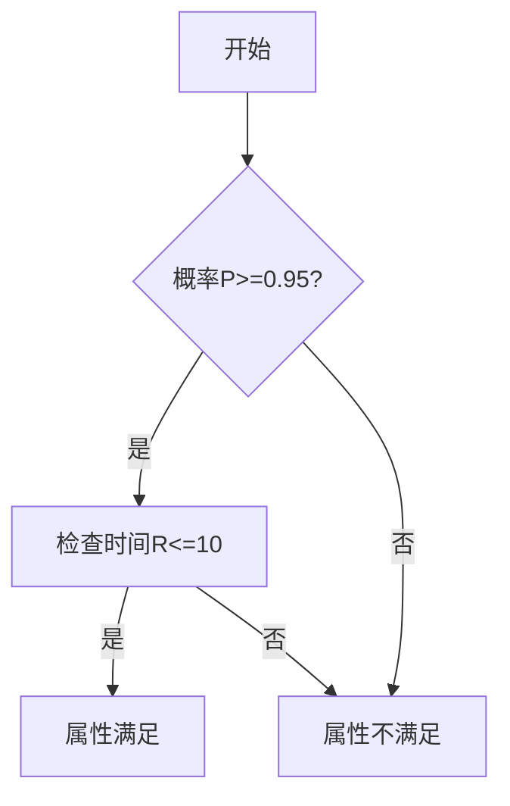

# PRISM 量化器

## 简介

PRISM量化器（Quantifiers）是PRISM属性规范语言中的核心组成部分，用于定义概率模型中的**概率测度**和**期望值**。通过量化器，我们可以精确描述系统行为的概率特性，例如：
- "系统在10步内达到目标状态的概率是多少？"
- "系统在长期运行中的平均能耗是多少？"

量化器主要分为两类：
1. **概率量化器（P）**：描述事件发生的概率
2. **期望量化器（R）**：描述随机变量的期望值

## 基本语法结构

PRISM量化器的基本语法遵循以下模式：

```
<quantifier> [ bound ] ( <property> )
```

其中：
- `<quantifier>` 是 `P` 或 `R`
- `[ bound ]` 是可选的比较运算符（如 `>=0.5`）
- `<property>` 是要评估的路径属性

## 概率量化器 (P)

### 语法说明

概率量化器用于计算某个路径属性成立的概率：

```
P [ bound ] ( <path-property> )
```

示例：计算系统在100个时间单位内达到"完成"状态的概率至少为90%：

```
P>=0.9 [ F<=100 "done" ]
```

### 实际案例

考虑一个简单的通信协议模型，我们想知道消息在3次重传内成功传递的概率：

```prism
// 模型定义示例（省略具体DTMC定义）
// 属性规范：
P=? [ F<=3 "message_delivered" ]
```

输出可能是：
```
Result: 0.784 (approx)
```

:::tip 解释
这个结果表示在3次重传内消息成功传递的概率约为78.4%
:::

## 期望量化器 (R)

### 语法说明

期望量化器用于计算随机变量的期望值：

```
R [ bound ] ( <reward-property> )
```

示例：计算系统在崩溃前平均能完成多少次任务：

```
R=? [ F "crash" ]
```

### 实际案例

假设我们有一个能耗模型，想计算系统在100个时间单位内的平均能耗：

```prism
// 奖励结构定义示例（省略具体定义）
// 属性规范：
R{"energy"}<=100 [ C<=100 ]
```

可能的输出：
```
Result: 85.3 (energy units)
```

## 量化器组合应用

PRISM允许组合多个量化器来表达复杂属性。例如，我们可以同时分析概率和期望：

```prism
// 同时查询成功概率和平均时间
P>=0.95 [ F "success" ] & R{"time"}<=10 [ F "success" ]
```



## 边界条件与比较运算符

量化器支持多种比较运算符来定义边界条件：

| 运算符 | 含义          | 示例                     |
|--------|---------------|--------------------------|
| `=?`   | 计算具体值    | `P=? [ F "error" ]`      |
| `>=`   | 大于等于      | `P>=0.99 [ F "safe" ]`   |
| `<=`   | 小于等于      | `R<=5.0 [ C<=100 ]`      |
| `>`    | 大于          | `P>0.5 [ F "goal" ]`     |
| `<`    | 小于          | `R<100 [ F "complete" ]` |

## 高级用法：嵌套量化器

对于复杂分析，可以嵌套使用量化器。例如，先计算某个状态的概率，再将其作为另一个量化器的条件：

```prism
// 如果错误概率小于1%，则检查平均恢复时间
filter(state, P<0.01 [ F "error" ], R{"recovery"}<=10 [ F "operational" ])
```

:::caution 注意
嵌套量化器可能导致计算复杂度显著增加，应谨慎使用
:::

## 总结

PRISM量化器提供了强大的方式来：
1. 量化系统行为的概率特性
2. 评估性能指标的期望值
3. 验证系统是否满足概率性需求规范

关键要点：
- 使用 `P` 量化器进行概率分析
- 使用 `R` 量化器进行期望值计算
- 组合量化器可以表达复杂需求
- 边界条件使验证更加灵活

## 练习与扩展

1. 基础练习：
   - 修改一个简单DTMC模型，计算不同状态的概率
   - 添加奖励结构，比较不同策略下的期望值

2. 进阶挑战：
   - 构建一个包含故障恢复的模型，同时分析可靠性和恢复时间
   - 使用过滤器实现条件量化分析

3. 推荐资源：
   - PRISM官方文档中的"Property Specification"章节
   - 《Principles of Model Checking》第10章
   - 斯坦福大学CS357课程中的概率模型检测部分