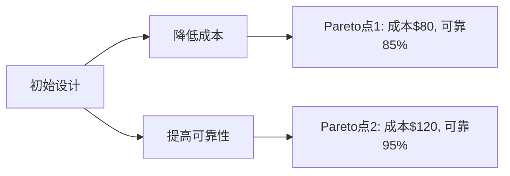

# PRISM 多目标属性

## 引言

在概率模型检查中，**多目标属性**允许我们同时分析系统的多个性能或可靠性指标。PRISM支持通过单一查询评估多个目标，这对于需要权衡不同属性的复杂系统特别有用。例如：
- 同时最小化成本和最大化可靠性
- 在满足时间约束的前提下优化资源利用率

## 基本语法

PRISM的多目标属性使用**逗号分隔**的目标列表，每个目标可以是：
- 概率查询 (`P`)
- 期望值查询 (`R`)
- 稳态查询 (`S`)

```prism
multi(P>=0.9 [ F "success" ], R{"cost"}<=100 [ F "done" ])
```

## 目标类型组合

### 1. 概率+概率组合
```prism
// 同时满足两个事件的发生概率
multi(P>=0.8 [ F "task1_complete" ], P<=0.1 [ F "error" ])
```

### 2. 概率+奖励组合
```prism
// 在保证成功率的同时限制资源消耗
multi(P>=0.95 [ F "delivered" ], R{"energy"}<=50 [ F "completed" ])
```

## Pareto最优分析

当目标之间存在冲突时（如提高可靠性会增加成本），PRISM可以计算**Pareto前沿**——一组无法在所有目标上同时改进的最优解。



## 实际案例：云计算任务调度

考虑一个云服务器集群需要：
1. 任务完成概率 ≥90%
2. 平均能耗 ≤200单位
3. 最大队列等待时间 ≤5分钟

```prism
multi(
    P>=0.9 [ F "tasks_completed" ],
    R{"power"}<=200 [ C ],
    R{"wait_time"}<=5 [ F "processed" ]
)
```

:::tip 实践建议
当目标量纲不同时（如时间和成本），建议先进行归一化处理：
```prism
// 将成本目标归一化为0-1范围
multi(P>=0.9 [ F "done" ], R{"cost"}<=1 [ F ] / max_cost)
```
:::

## 数值查询方法

对于需要探索参数空间的情况，可以使用`filter`函数：

```prism
filter(range, x, multi(P>=x [ F "ok" ], R{"time"}<=10 [ F ]), 
       range=[0.7:0.05:0.95])
```

## 常见错误处理

:::caution 注意冲突目标
以下查询可能无解：
```prism
multi(P>=1.0 [ F "perfect" ], R{"cost"}<=0 [ F ])
```
PRISM会返回`false`并提示目标冲突
:::

## 总结

多目标属性允许：
- 同时分析多个关键指标
- 识别设计权衡的Pareto前沿
- 通过数值查询探索参数空间

## 扩展练习

1. 修改下面查询，要求同时满足成功概率≥80%且平均响应时间≤3秒：
```prism
multi(P>=0.7 [ F "response" ], R{"time"}<=5 [ F ])
```

2. 为交通信号灯系统设计一个多目标查询，要求：
   - 车辆平均等待时间≤30秒
   - 行人等待概率≤0.2
   - 系统能耗≤50单位/小时

## 延伸阅读
- PRISM手册第10章"Multi-objective Model Checking"
- 《概率模型检查》第7章多目标优化