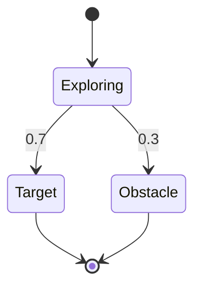

## 引言

概率计算树逻辑（**Probabilistic Computation Tree Logic, PCTL**）是PRISM模型检查器中用于描述概率系统时序属性的核心逻辑语言。它扩展了传统的计算树逻辑(CTL)，增加了概率运算符，能够精确表达"系统以至少90%概率满足某属性"等量化要求。本章将逐步解析PCTL的语法结构、语义解释及在PRISM中的实际应用。

## PCTL基础语法

PCTL公式由**状态公式**和**路径公式**组成，通过概率运算符关联：

### 状态公式
定义在系统状态上，基本形式包括：
- `true`：所有状态满足
- `"label"`：被标记为"label"的状态
- `P~p~[ψ]`：路径公式ψ在当前状态成立的概率满足~p~关系（如 `≥0.9`）
- 逻辑组合：`¬Φ`, `Φ ∧ Ψ`, `Φ ∨ Ψ`

### 路径公式
描述状态序列的时序属性：
- `X Φ`：下一状态满足Φ
- `Φ U Ψ`：Φ一直保持直到Ψ成立
- `F Φ`：最终某状态满足Φ（等价于`true U Φ`）
- `G Φ`：所有状态满足Φ

:::note 运算符优先级
`¬` > `∧` = `∨` > `P~p~[...]`
:::

## 语义详解

### 概率运算符
`P~p~[ψ]` 表示从当前状态出发，满足路径公式ψ的执行路径的概率与阈值~p~的关系。例如：
- `P≥0.5[F "success"]`：成功状态最终被访问的概率至少50%
- `P<0.1[G ¬"error"]`：全程不出现错误的概率低于10%

### 时间边界扩展
PRISM支持带时间界限的PCTL（PCTL*）：
```prism
P≥0.9[F<=10 "alarm"]  // 10个时间单位内触发警报的概率≥90%
P=?[F[5,10] "done"]   // 计算5-10步内完成的概率
```

## 实际案例

### 案例1：通信协议可靠性
验证通信协议在3次重传内成功发送的概率：
```prism
// PRISM模型代码片段
const int MAX_RETRY = 3;
formula success = (retries <= MAX_RETRY) & (status=SUCCESS);
P≥0.99[F success]  // 要求成功概率≥99%
```

### 案例2：机器人路径规划
确保机器人在20步内到达目标且避障概率：

对应的PCTL公式：
```prism
P≥0.95[F<=20 !"obstacle" & "target"]
```

## PRISM 实战示例

### 输入模型
```prism
// 简单DTMC模型
dtmc

module example
    state : [0..2] init 0;
    [] state=0 -> 0.6: (state'=1) + 0.4: (state'=2);
    [] state=1 -> 1: (state'=0);
    [] state=2 -> 1: (state'=2);
endmodule

label "safe" = (state!=2);
```

### 验证属性
1. 计算永远不进入state 2的概率：
```prism
P=?[G "safe"]
```
2. 检查3步内保持安全的概率是否超过80%：
```prism
P>0.8[G<=3 "safe"]
```

### 典型输出
```
Result: 0.857143 (满足P>0.8[G<=3 "safe"])
```

## 总结

PCTL为概率系统验证提供了：
- **量化表达**：精确描述概率阈值要求
- **时序推理**：支持时间边界和路径模式组合
- **实用工具**：与PRISM模型无缝集成

:::tip 进阶练习
1. 修改上述DTMC模型的转移概率，观察PCTL验证结果变化
2. 尝试用`U`运算符表达"在遇到错误前完成初始化"的属性
:::

## 扩展资源
- [PRISM官方PCTL文档](https://www.prismmodelchecker.org/manual/PropertySpecification/PCTL)
- 《Principles of Model Checking》第10章
- 在线PCTL验证工具：PRISM-games