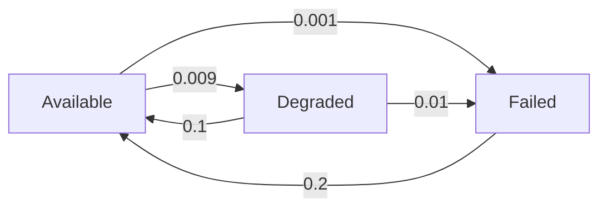

## 引言

概率计算树逻辑（Probabilistic Computation Tree Logic, **PCTL***）是PRISM模型检查器中用于描述概率系统时序属性的扩展逻辑语言。它结合了传统CTL*的时序表达能力与概率运算符，允许用户对马尔可夫链等模型的概率行为进行形式化规约。本章将逐步解析PCTL*的语法结构、语义定义及实际应用。

## PCTL*基础语法

PCTL*由**状态公式**和**路径公式**组成，通过概率运算符连接：

### 状态公式（State Formulas）
- `true`/`false`: 逻辑常量
- 原子命题（如 `x > 5`）
- 逻辑组合：`¬φ`, `φ ∧ ψ`, `φ ∨ ψ`
- 概率约束：`P~p~ [ψ]` （路径公式ψ成立的概率满足~p~关系）

### 路径公式（Path Formulas）
- 线性时序运算符：`X φ`, `φ U ψ`, `F φ`, `G φ`
- 嵌套逻辑：允许状态公式与路径公式自由组合

:::tip 运算符优先级
`¬` > `∧`/`∨` > `P~p~` > 时序运算符
:::

## 语义解析

### 概率约束示例
```prism
P>=0.9 [ F "success" ]
```
表示"最终达到success状态的概率至少为90%"。

### 嵌套时序逻辑
```prism
P<0.1 [ G (request -> F<=5 response) ]
```
验证"请求后5步内得到响应的概率始终低于10%"的罕见故障场景。

## 实际案例：云服务SLA验证

假设我们需要验证某云服务的可靠性：

```prism
// 定义原子命题
label "available" = (status=0);
label "degraded" = (status=1);
label "failed" = (status=2);

// 检查连续可用性概率
P>=0.999 [ G ("available" | "degraded") ]

// 验证故障恢复时间
P>=0.95 [ "failed" => F<=10 "available" ]
```

## 可视化状态转换



## 常见模式库

| 模式描述                | PCTL*表达式                     |
|-------------------------|---------------------------------|
| 最终必然达到目标        | `P>=1 [ F φ ]`                 |
| 始终以概率p保持安全     | `P>=p [ G φ ]`                 |
| 临界事件最大响应时间    | `P>=p [ φ => F<=k ψ ]`         |

## 总结与练习

### 关键要点
- PCTL*支持嵌套概率时序表达式
- 概率运算符`P~p~`是验证核心
- 路径公式描述行为模式，状态公式定义约束条件

### 巩固练习
1. 为交通信号灯系统编写PCTL*公式，要求："红灯后5秒内出现绿灯的概率超过99%"
2. 扩展云服务案例，添加"降级状态在1小时内恢复"的概率约束

### 扩展阅读
- PRISM官方文档《Property Specification》
- 《Principles of Model Checking》第10章