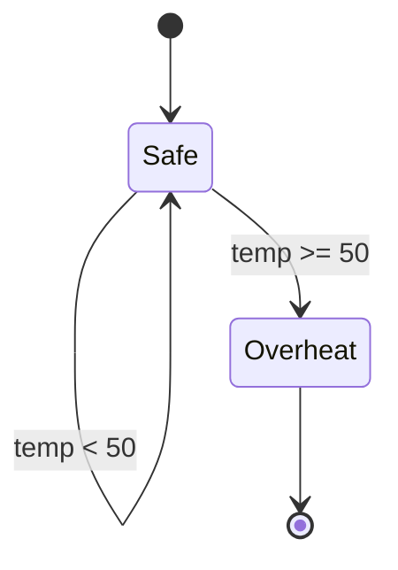

# PRISM 安全性属性

## 介绍

安全性属性（Safety Properties）是形式化验证中的核心概念，表示系统在**任何执行路径**中都不会进入"坏状态"。在PRISM中，这类属性通常用**线性时序逻辑（LTL）**或**PCTL**公式表达，例如"系统永远不会死锁"或"错误状态不可达"。

:::note 关键特征
- **不变性**：始终满足的条件（如 `G ¬error`）
- **边界约束**：在特定步骤前不违反（如 `F[<=10] failure`）
- **概率扩展**：如 `P>=0.95 [ G safe ]`
:::

## 基本语法

PRISM中定义安全性属性的典型模式：

```prism
// 确定性模型中的LTL公式
P>=1 [ G !(x > threshold) ]

// 概率模型中的PCTL
P>=0.99 [ F[<=100] "alarm_triggered" ]
```

**符号说明**：
- `G`：全局（Globally，始终满足）
- `F`：最终（Finally，最终会满足）
- `P`：概率操作符
- `!`：逻辑非

## 实际案例

### 案例1：温度控制器
验证"温度永远不会超过临界值50℃"：

```prism
const double THRESHOLD = 50;
formula overheat = (temp >= THRESHOLD);

// 验证属性
P>=1 [ G !overheat ]
```

输出结果若显示 `Probability: 1`，则验证通过。

### 案例2：通信协议
验证"数据包在100次传输内丢失概率低于5%"：

```prism
P<0.05 [ F[<=100] packet_lost ]
```

## 状态机可视化



## 常见模式

| 属性类型          | PRISM公式示例                 | 自然语言描述               |
|-------------------|-------------------------------|--------------------------|
| 绝对安全性        | `P>=1 [ G !fail ]`            | 永不失败                 |
| 概率安全性        | `P>=0.99 [ G safe ]`          | 99%概率保持安全          |
| 时间约束安全性    | `P>=0.9 [ F[<=10] shutdown ]` | 10步内安全关闭概率90%    |

## 调试技巧

:::caution 常见错误
1. **未定义命题**：确保公式中所有标识符（如`"alarm"`）在模型中明确定义
2. **概率不收敛**：对无限时域属性使用`filter`或调整迭代次数
3. **状态爆炸**：使用`const`限制变量范围
:::

## 总结

安全性属性验证是PRISM的核心应用场景，通过本指南你已学习：
- 基本LTL/PCTL语法
- 概率边界的定义方法
- 实际系统的建模技巧

**延伸练习**：
1. 修改温度控制器案例，添加冷却系统后的属性验证
2. 尝试用`P=? [ G !error ]`计算具体概率值
3. 组合多个安全性属性（如 `P>=1 [ G !fail1 ] & P>=1 [ G !fail2 ]`）

:::tip 扩展阅读
- PRISM手册第10章：Temporal Logic Properties
- 《Principles of Model Checking》第5章
:::