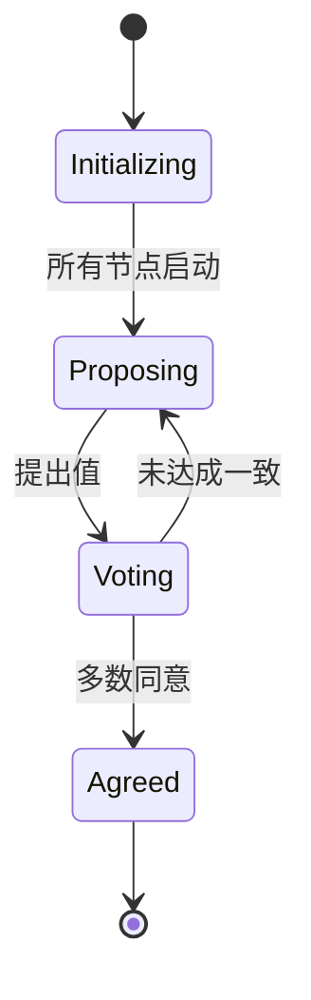

# PRISM 活性属性

## 介绍

活性属性（Liveness Properties）是时序逻辑中描述系统"最终必须发生某事"的一类关键性质。在PRISM模型检测工具中，活性属性通常用**线性时序逻辑（LTL）**或**概率时序逻辑（PCTL）**公式表示，用于验证系统是否会最终达到期望状态。

与安全性属性（"坏事永远不会发生"）不同，活性属性关注的是"好事最终会发生"。例如：
- 进程最终会获得资源
- 消息最终会被传递
- 系统最终会恢复正常状态

## 基本概念

### 活性属性的数学表达

在PRISM中，活性属性通常使用以下形式的LTL公式：

```
F φ  ("最终φ成立")
```

其中φ是某个状态属性。在概率系统中，我们可能关注的是该属性成立的概率：

```
P≥p [ F φ ]  ("φ最终成立的概率至少为p")
```

### 常见活性模式

1. **无条件活性**：`F φ`（系统最终会满足φ）
2. **条件活性**：`φ → F ψ`（如果φ成立，则最终ψ会成立）
3. **重复活性**：`G F φ`（φ会无限次成立，也称为"持续性"）

## PRISM 中的实现

### 基本语法示例

考虑一个简单的资源分配系统，我们想验证"进程A最终会获得资源"：

```prism
// 在PRISM模型中定义奖励结构
rewards "waiting_time"
    [request] process_A_waiting : 1;
endrewards

// 验证属性
P>=1 [ F process_A_has_resource ]
```

### 概率性活性验证

对于概率系统，我们可以查询活性属性成立的概率：

```prism
// 消息最终被传递的概率
P=? [ F message_delivered ]

// 在时间限制内的活性
P=? [ F<=100 system_operational ]
```

## 实际案例

### 案例1：通信协议

验证一个通信协议中"消息最终会被成功传递"的概率：

```prism
// 模型定义部分省略...
// 验证属性
const double p;
P>=p [ F delivered ]
```

### 案例2：分布式共识

在分布式共识算法中验证"所有节点最终会达成一致"：



对应的PRISM属性验证：

```prism
// 最终所有节点值相同
P=? [ F (node1_value = node2_value & node2_value = node3_value) ]
```

## 常见问题与技巧

:::tip 验证无限行为
对于无限状态空间，PRISM提供了多种技术来处理活性属性验证：
- 使用`-simpath`参数进行模拟路径验证
- 设置适当的时间界限`F<=t`
:::

:::caution 状态爆炸问题
验证复杂系统的全局活性属性可能导致状态爆炸。解决方案包括：
1. 使用抽象技术
2. 分解为局部属性验证
3. 应用对称性减少
:::

## 总结

活性属性是验证系统长期行为的重要工具，PRISM提供了强大的语法和算法来验证：
- 确定性系统的必然活性
- 概率系统的概率性活性
- 时间约束下的活性

通过组合LTL/PCTL公式和PRISM的模型检查能力，我们可以确保系统设计满足关键的活性要求。

## 延伸学习

1. 尝试在PRISM GUI中可视化活性属性的反例路径
2. 比较`F φ`和`G F φ`在不同系统模型中的表现差异
3. 研究如何将活性属性与奖励结构结合，优化系统性能

练习：为一个简单的互斥协议模型编写PRISM属性，验证"每个进程最终都能进入临界区"的概率。