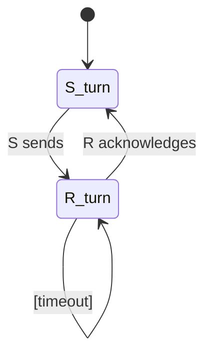

# PRISM 公平性属性

## 介绍

公平性（Fairness）是形式化验证中的重要概念，尤其在并发系统建模中。它确保系统不会无限期地忽略某些可能的行为路径。在PRISM中，公平性属性通过时序逻辑表达式约束模型的行为，防止不现实的无限循环场景。

:::note 为什么需要公平性？
想象两个进程竞争资源：若模型允许一个进程永远被忽略（"饥饿"状态），则验证结果可能不反映现实。公平性约束强制模型考虑所有进程的合理调度。
:::

## 公平性基础

PRISM支持两种公平性定义方式：

1. **强公平性**：若某个条件无限次*可能成立*，则它必须无限次*实际成立*
2. **弱公平性**：若某个条件*最终永远可能成立*，则它必须无限次*实际成立*

数学表达为：
- 强公平性：`□◇enabled → ◇□taken`
- 弱公平性：`◇□enabled → ◇□taken`

## PRISM 语法实现

在PRISM的PCTL/CSL逻辑中，公平性通过`A[]`（所有路径）或`E<>`（存在路径）操作符结合条件表达式定义：

```prism
// 弱公平性示例：如果进程1持续请求资源，则最终会获得
A[] (process1_waiting => E<> process1_active)

// 强公平性示例：资源分配器必须响应所有请求者
A[] (E<> process1_request) && (E<> process2_request)
```

## 案例研究：交替位协议

考虑一个发送方(S)和接收方(R)的通信协议，我们需要验证"双方最终都会无限次获得传输机会"：



对应的PRISM公平性约束：

```prism
// 弱公平性约束
fairness (sender_turn => X receiver_turn)
fairness (receiver_turn => X sender_turn)

// 验证属性
P>=1 [ F G sender_turn ]  // 发送方无限次活跃
```

## 实际验证示例

在PRISM GUI或命令行中添加公平性约束：

1. 在模型文件中添加`fairness`声明：
```prism
fairness {process1_enabled} 
fairness {process2_enabled}
```

2. 验证属性时自动应用这些约束：
```prism
P=? [ F "task_completed" ]
```

:::caution 注意
未声明公平性时，PRISM可能给出概率=0的结果（如存在无限循环路径），添加公平性约束后结果会更合理。
:::

## 高级主题：公平性与概率

对于概率系统（MDPs），公平性影响概率计算。例如：

```prism
// 在非公平模型中，此概率可能为0
P>=0.99 [ F "success" ] 

// 添加公平性后
fairness {attempt_possible}
// 现在概率反映真实情况
```

## 总结

关键要点：
- 公平性排除不现实的无限执行路径
- PRISM通过`fairness`关键字或时序逻辑公式实现
- 强/弱公平性适用于不同场景
- 概率验证结果依赖公平性假设

## 延伸练习

1. 在PRISM示例`leader_election.nm`中添加公平性约束，验证"最终必选出领导者"
2. 比较有无公平性约束时`P=? [ F "consensus" ]`的结果差异
3. 设计一个违反弱公平性但满足强公平性的模型

## 扩展阅读
- PRISM手册第10章：Fairness Constraints
- 《Principles of Model Checking》第3.5节
- 经典论文：LTL and Fairness in Probabilistic Systems