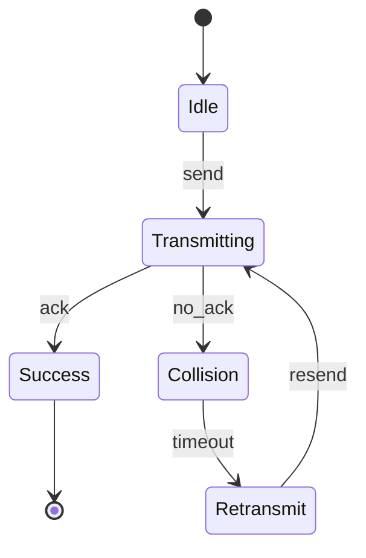

# PRISM 逻辑表达式简化技巧

## 引言

在PRISM概率模型检查器中，时序逻辑表达式是描述系统行为的关键工具。然而，复杂的逻辑表达式可能导致模型难以理解和维护。本文将介绍一系列简化PRISM逻辑表达式的实用技巧，帮助初学者编写更清晰、高效的属性规范。

## 基础简化原则

### 1. 使用逻辑等价关系

PRISM支持标准的逻辑运算符(`&`, `|`, `!`)，可以利用布尔代数的基本定律进行简化：

```prism
// 原表达式
P>=0.9 [ !(a & !b) | (c & true) ]

// 简化后 (应用德摩根定律和恒等律)
P>=0.9 [ (!a | b) | c ]
```

### 2. 利用时序逻辑特性

PRISM的PCTL/CSL时序逻辑具有特殊性质，可以优化表达式：

```prism
// 原表达式
P=? [ F<=10 (F<=5 a) ]  // 嵌套的F(最终)运算符

// 简化后 (F<=10 F<=5 ≡ F<=5)
P=? [ F<=5 a ]
```

## 高级简化技巧

### 3. 状态标签(Label)的运用

定义有意义的标签可以大幅简化复杂表达式：

```prism
// 定义标签
label "safe" = (x < 10) & (y > 0);
label "target" = (z = 5) | (z = 7);

// 简化前
P>=0.95 [ F ((x < 10) & (y > 0) & ((z = 5) | (z = 7))) ]

// 使用标签后
P>=0.95 [ F ("safe" & "target") ]
```

### 4. 路径概率的合并计算

当验证多个相似属性时，可以合并概率计算：

```prism
// 原多个属性
P=? [ F<=10 a ];
P=? [ F<=10 b ];
P=? [ F<=10 c ];

// 合并为一个属性
P=? [ F<=10 (a | b | c) ]
// 然后通过过滤分析单个情况
```

## 实际案例研究

### 通信协议案例

考虑一个简单的重传协议模型，我们需要验证"在3次重传内成功传输的概率"：

```prism
// 未简化版本
P=? [ F<=3 (transmitted & !(F<=2 (collision & F (retransmit)))) ]

// 简化步骤：
// 1. 定义标签
label "success" = transmitted & !collision;
label "fail" = collision & retransmit;

// 2. 简化后表达式
P=? [ F<=3 ("success" & !(F<=2 "fail")) ]
```



## 常见陷阱与注意事项

:::caution 注意运算符优先级
PRISM中逻辑运算符的优先级可能与你预期不同，务必使用括号明确意图：

```prism
// 容易混淆的表达式
P=? [ a | b & c ]  // 实际解析为 a | (b & c)

// 明确写法
P=? [ (a | b) & c ]
```

:::warning 过度简化风险
虽然简化很重要，但要注意不能改变原始语义：

```prism
// 错误简化示例 (改变了逻辑含义)
P=? [ F (a & b) ]  ≠  P=? [ F a ] & P=? [ F b ]
```

## 总结与练习

### 关键要点总结
1. 利用布尔代数定律简化基础逻辑表达式
2. 使用时序逻辑的数学性质优化嵌套运算符
3. 通过状态标签提高复杂表达式的可读性
4. 合并相似属性提高验证效率

### 巩固练习
1. 简化以下表达式：`P>=0.8 [ !(a | b) & (F<=5 c) ]`
2. 为交通灯系统创建有意义的标签，并重写属性"在红灯后10秒内变为绿灯的概率"
3. 找出以下表达式中的冗余部分：`P=? [ F (a | (b & (a | c))) ]`

### 扩展学习
- PRISM官方文档中的"Property Specification"章节
- 时序逻辑与布尔代数经典教材
- 模型检查中的属性模式研究论文