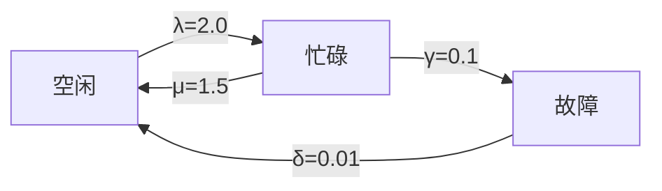

# PRISM 连续随机逻辑(CSL)

## 引言
连续随机逻辑（Continuous Stochastic Logic, CSL）是用于分析连续时间马尔可夫链（CTMC）的概率时序逻辑。它是PRISM模型检测器的核心逻辑之一，允许用户表达关于系统在连续时间内的概率行为的高级性质。本章将介绍CSL的基本语法、语义及实际应用。

---

## CSL基础语法
CSL扩展了传统的时序逻辑，增加了概率运算符和时间约束。其核心语法如下：

```
φ ::= true | false | a | ¬φ | φ ∧ φ | P~p[ψ] | S~p[φ]
ψ ::= X φ | φ U≤t φ | φ U φ
```
其中：
- `P~p[ψ]` 表示路径公式 `ψ` 的概率满足边界 `~p`（如 `≥0.5`）
- `S~p[φ]` 表示稳态概率满足边界 `~p`
- `X`、`U` 和 `U≤t` 分别是"下一个"、"直到"和"时间约束直到"运算符

:::tip 示例公式
`P≥0.9 [ true U≤10 "error" ]` 表示："在10个时间单位内发生错误的概率至少为90%"
:::

---

## CSL运算符详解

### 1. 概率运算符 (P)
- **语法**：`P~p[ψ]`
- **语义**：计算路径公式 `ψ` 的概率是否满足边界 `~p`（如 `>0.7`）

```prism
// PRISM模型中的CSL属性示例
P>=0.95 [ !fail U<=100 success ]
```

### 2. 稳态运算符 (S)
- **语法**：`S~p[φ]`
- **语义**：系统达到稳态时满足 `φ` 的概率

```prism
// 稳态下系统可用的概率
S<0.01 [ queue_size > 10 ]
```

### 3. 时间约束路径公式
| 运算符 | 含义                  | 示例                     |
|--------|-----------------------|--------------------------|
| `X φ`  | 下一个状态满足 φ       | `P>0 [ X x=1 ]`          |
| `φ1 U φ2` | φ1 直到 φ2 成立    | `P>=1 [ true U "done" ]` |
| `φ1 U≤t φ2` | 在时间 t 内 φ1 直到 φ2 | `P>0.5 [ x=1 U<=5.2 x=2 ]` |

---

## 实际案例：云服务可靠性

### 模型场景
分析云服务器在负载下的故障概率：
```prism
// PRISM模型片段（CTMC）
module Server
    state : [0..2] init 0;  // 0=空闲, 1=忙碌, 2=故障
    [] state=0 -> 2.0 : (state'=1);
    [] state=1 -> 1.5 : (state'=0) + 0.1 : (state'=2);
    [] state=2 -> 0.01 : (state'=0);
endmodule
```

### CSL属性验证
1. **瞬时故障概率**：
   ```prism
   P=? [ F<=10 state=2 ]  // 10小时内故障的概率
   ```
   输出结果可能是：`0.382`

2. **稳态可用性**：
   ```prism
   S=? [ state!=2 ]  // 长期运行时的可用概率
   ```
   典型输出：`0.952`

---

## 可视化分析


---

## 总结
CSL为连续时间系统提供了强大的规范语言：
- 支持概率阈值验证（`P` 运算符）
- 支持长期行为分析（`S` 运算符）
- 可组合时间约束与逻辑运算符

:::note 练习建议
1. 修改上述服务器模型，添加"过热"状态并编写CSL属性验证恢复概率
2. 尝试用`S`运算符计算系统的平均队列长度
:::

## 扩展阅读
- [PRISM官方文档 - CSL章节](https://www.prismmodelchecker.org/manual/PropertySpecification/CSL)
- 《Principles of Model Checking》第10章（MIT Press）
``` 

注意：实际使用时请确保：
1. 所有代码块使用正确的语言标识（如`prism`）
2. Mermaid图表需被