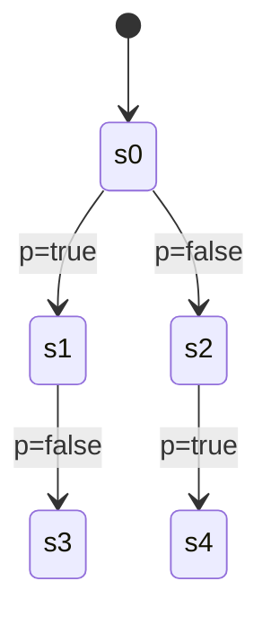

## 引言

计算树逻辑（Computation Tree Logic, CTL）是一种用于描述系统时序行为的模态逻辑，广泛应用于模型检测工具（如PRISM）中。CTL允许我们表达系统在**时间演化过程中**可能满足的性质，例如“从当前状态出发，最终必然达到目标状态”。本章将介绍CTL的语法、语义及其在PRISM中的实际应用。

---

## CTL基础

### 语法结构
CTL公式由**状态公式**和**路径公式**组成，通过以下运算符组合：
- **路径量词**（描述路径的存在性）：
  - `A` (All)：所有路径满足。
  - `E` (Exists)：存在至少一条路径满足。
- **时序运算符**（描述时间关系）：
  - `F` (Finally)：未来某时刻满足。
  - `G` (Globally)：始终满足。
  - `U` (Until)：直到某条件成立。
  - `X` (Next)：下一时刻满足。

:::note
CTL要求**每个时序运算符必须与一个路径量词配对**。例如，`AF p` 表示“所有路径最终满足p”。
:::

### 语义示例

对于上述状态图：
- `AF p` 在`s0`成立（所有路径最终到达`p=true`的状态）。
- `EG p` 在`s0`不成立（不存在无限路径始终满足`p`）。

---

## PRISM 中的CTL语法

在PRISM中，CTL公式通过属性规范语言编写，例如：
```prism
// 检查"所有路径最终满足p"
P>=1 [ A F p ]

// 检查"存在路径使得p一直为真"
P>0 [ E G p ]
```

### 实际案例：交通灯系统
假设一个交通灯模型，状态为`red`、`yellow`、`green`。验证以下性质：
1. **必然性**：“红灯后最终会变绿”：
   ```prism
   P>=1 [ A F (color=green) ]
   ```
2. **可能性**：“存在无限循环在红灯和黄灯之间切换”：
   ```prism
   P>0 [ E G (color=red | color=yellow) ]
   ```

---

## 进阶应用：嵌套CTL公式

组合多个运算符可以表达复杂性质。例如：
```prism
// "所有路径在达到p之前始终满足q"
P=? [ A q U p ]

// "存在路径在下一时刻满足p，且之后永远满足q"
P>0 [ E X (p & G q) ]
```

:::caution
在PRISM中验证嵌套公式时，需注意**状态空间爆炸问题**。简化模型或使用抽象技术可提升效率。
:::

---

## 总结与练习

### 关键点总结
- CTL通过路径量词和时序运算符描述时序性质。
- PRISM将CTL嵌入概率查询，支持`P`和`R`运算符。
- 嵌套公式需谨慎处理计算复杂度。

### 练习
1. 为以下性质编写CTL公式：
   - “系统永远不会死锁”（提示：使用`AG`）。
   - “存在一条路径使得`error`状态可达”。
2. 在PRISM中创建一个简单的马尔可夫链，验证`AF success`的概率。

### 扩展阅读
- PRISM官方文档：[Temporal Logic Properties](https://www.prismmodelchecker.org/manual/PropertySpecification/TemporalLogic)
- 《Principles of Model Checking》第3章（CTL详细理论）。