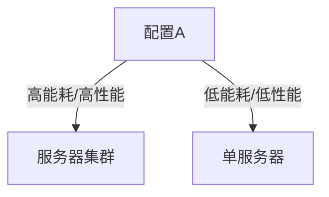

# PRISM 奖励扩展逻辑

## 介绍

PRISM的**奖励扩展逻辑**（Reward Extensions）是对其概率时序逻辑的增强，允许用户量化系统模型中的"成本"或"收益"。这种逻辑在分析资源消耗、性能指标或风险回报场景时特别有用。例如：

- 计算系统达到目标状态所需的平均能量消耗
- 评估服务器在故障前处理的平均请求数
- 测量机器人完成任务的时间成本

:::note 什么是奖励结构？
在PRISM中，奖励结构是为模型状态和/或转换分配的数值。这些数值可以代表时间、能量、金钱等可量化的指标。
:::

## 基本语法

PRISM支持两种主要奖励类型：

1. **状态奖励**：当系统处于某状态时累积的奖励
2. **转移奖励**：当系统执行某状态转换时获得的奖励

定义奖励结构的基本语法：

```prism
rewards "reward_name"
    [action] guard : reward;
    state_predicate : reward;
endrewards
```

### 示例1：简单状态奖励

```prism
rewards "time"
    s=1 : 1; // 在状态1每步耗时1单位
    s=2 : 2; // 状态2耗时更长
endrewards
```

### 示例2：转移奖励

```prism
rewards "energy"
    [move] true : 5; // 每次移动消耗5单位能量
    [idle] true : 1; // 空闲时消耗1单位
endrewards
```

## 奖励属性规范

PRISM扩展了PCTL（概率计算树逻辑）以支持奖励属性查询，使用`R`运算符：

```
R{"reward_name"}[bound] =? [property]
```

常用属性类型：

| 属性类型          | 含义                          | 示例                     |
|-------------------|-----------------------------|-------------------------|
| `R{"r"}=? [C]`    | 累计奖励                     | 总能量消耗              |
| `R{"r"}=? [F phi]`| 达到φ状态前的奖励            | 完成任务前的耗时        |
| `R{"r"}=? [S]`    | 长期稳态下的平均奖励          | 系统平均功耗           |

### 示例3：查询属性

```prism
// 检查完成任务前的平均能耗
R{"energy"}=? [F task_complete]

// 系统在20步内的总耗时
R{"time"}<=20 [C]
```

## 实际案例研究

### 案例：云计算成本分析

考虑一个云服务器模型，有三种状态：`空闲`、`活跃`和`过载`。我们定义以下奖励：

```prism
rewards "cost"
    // 电力成本（按状态）
    state="idle" : 1;
    state="active" : 5;
    state="overloaded" : 8;
    
    // 运维成本（按转换）
    [recovery] true : 20; // 恢复操作成本
endrewards

rewards "revenue"
    [request_served] true : 3; // 每个服务的请求收益
endrewards
```

可以查询重要指标：

```prism
// 平均每小时净收益
(R{"revenue"}=? [S]) - (R{"cost"}=? [S])

// 系统崩溃前的总运维成本
R{"cost"}=? [F state="failed"]
```

## 高级主题

### 多目标优化

PRISM允许同时分析多个奖励结构，支持权衡分析：



对应的PRISM查询：

```prism
// 找出能耗<100且性能>50的配置
filter(energy<100 & performance>50, 
    R{"energy"}=? [C], R{"throughput"}=? [S])
```

### 时变奖励

使用PRISM的`formula`定义动态奖励：

```prism
formula dynamic_reward = t<100 ? 1 : 2; // 100步后奖励翻倍

rewards "scaling"
    state="processing" : dynamic_reward;
endrewards
```

## 总结

PRISM的奖励扩展逻辑提供了强大的量化分析能力：
- 支持状态和转移两种奖励机制
- 可组合多个奖励结构进行复杂分析
- 与概率模型检测无缝集成
- 适用于性能、资源消耗、经济效益等场景分析

## 练习与拓展

1. 为交通信号灯模型定义"平均等待时间"奖励结构
2. 编写查询计算系统在崩溃前处理的最大请求数
3. 尝试组合能耗和延迟奖励进行多目标优化

:::tip 进一步学习
参考PRISM官方文档的[Reward Structures](https://www.prismmodelchecker.org/manual/PropertySpecification/Reward-basedProperties)章节了解更多高级特性。
:::